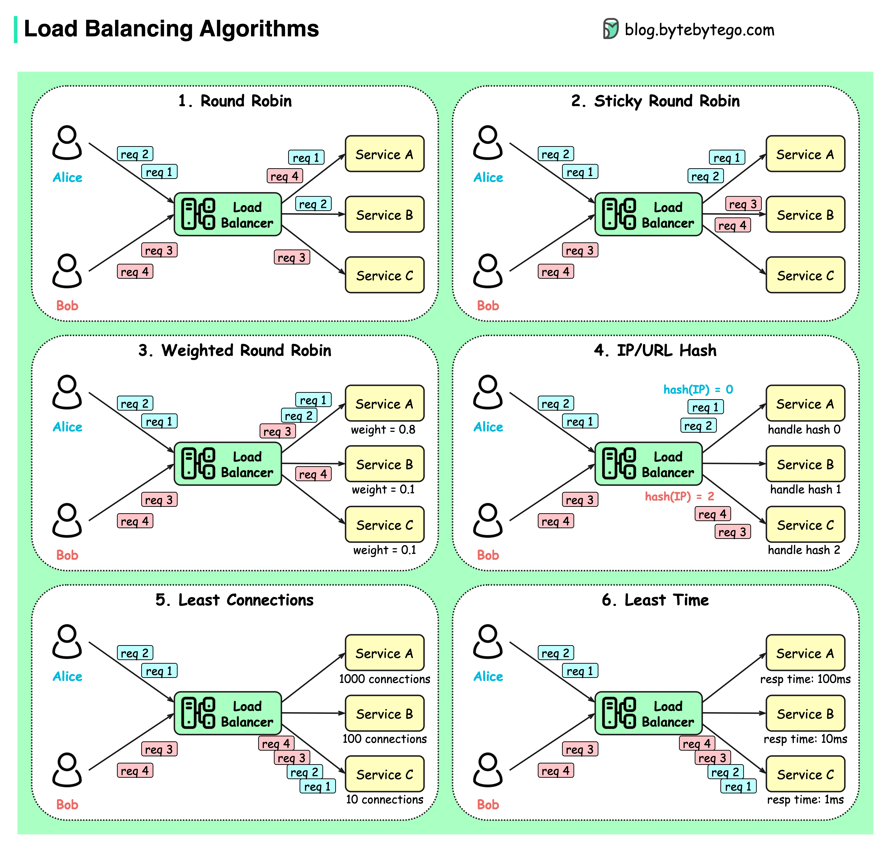

# ⚖️ 6种负载均衡算法详解！静态+动态全覆盖

> 轮询、加权轮询、哈希、最少连接……

负载均衡怎么决定把请求发给谁？6种算法分两类 👇

📌 **静态算法：**
- **轮询（Round Robin）** — 按顺序依次分配，要求服务无状态
- **粘性轮询** — 同一用户的请求始终打到同一实例
- **加权轮询** — 按权重分配，性能强的多接请求
- **哈希** — 对IP或URL做哈希，相同请求打到相同实例

📌 **动态算法：**
- **最少连接** — 新请求发给当前连接数最少的实例
- **最快响应** — 新请求发给响应时间最短的实例

💡 静态算法简单但不够智能，动态算法更灵活但实现更复杂。大多数场景用加权轮询就够了。

你们用的哪种算法？👇

---

#负载均衡 #算法 #系统设计 #后端 #架构 #Nginx #面试
