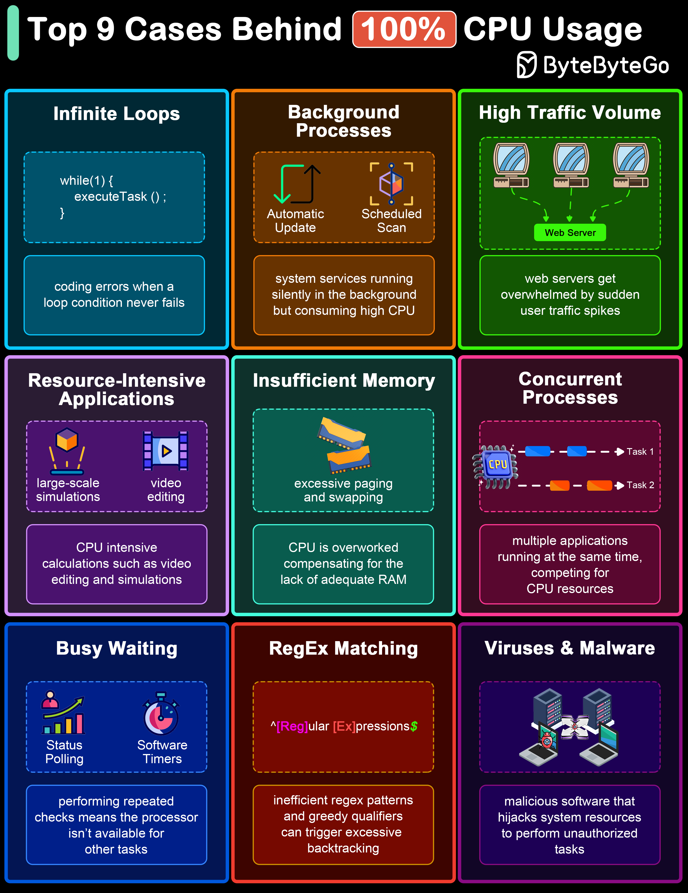

# 🔥 CPU飙到100%的9大原因！排障必看

> 死循环、内存不足、正则匹配……

CPU 突然飙到100%？先排查这9个常见原因 👇

📌 **死循环** — 代码bug导致无限循环
📌 **后台进程** — 不知名的后台任务占用资源
📌 **高流量** — 请求量突增，服务器扛不住
📌 **资源密集型应用** — 视频编码、大数据处理等
📌 **内存不足** — 频繁GC或swap导致CPU飙高
📌 **并发进程过多** — 线程/进程太多，上下文切换开销大
📌 **忙等待（Busy Waiting）** — 空转消耗CPU
📌 **正则表达式匹配** — 复杂正则导致回溯爆炸
📌 **恶意软件/病毒** — 挖矿程序等

💡 遇到CPU 100%，先用 top/htop 找到占用最高的进程，再针对性排查。正则回溯爆炸是很多人忽略的坑。

你遇到过CPU飙高的情况吗？👇

---

#CPU #排障 #性能 #运维 #后端 #Linux #程序员
