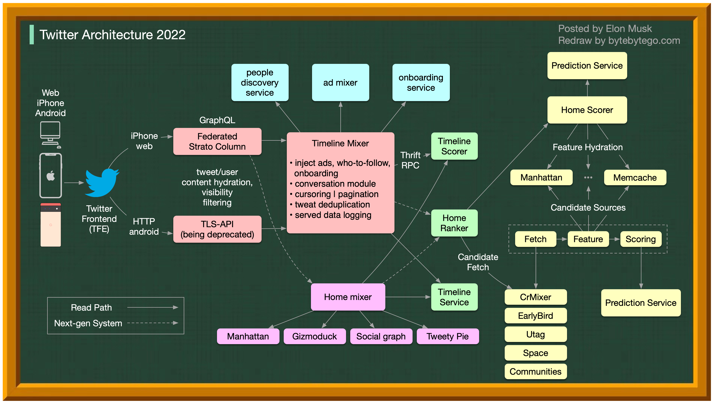

# 🐦 Twitter架构10年演进！2012 vs 2022

> 十年间发生了什么变化？

Twitter 的架构在过去10年经历了巨大变化，从简单到复杂，从单体到分布式。

💡 架构演进是一个持续的过程，没有终点。每一次变化都是为了解决当时的瓶颈问题。

你觉得 Twitter 架构最大的变化是什么？👇

---

#Twitter #架构演进 #系统设计 #分布式 #后端 #案例 #程序员
