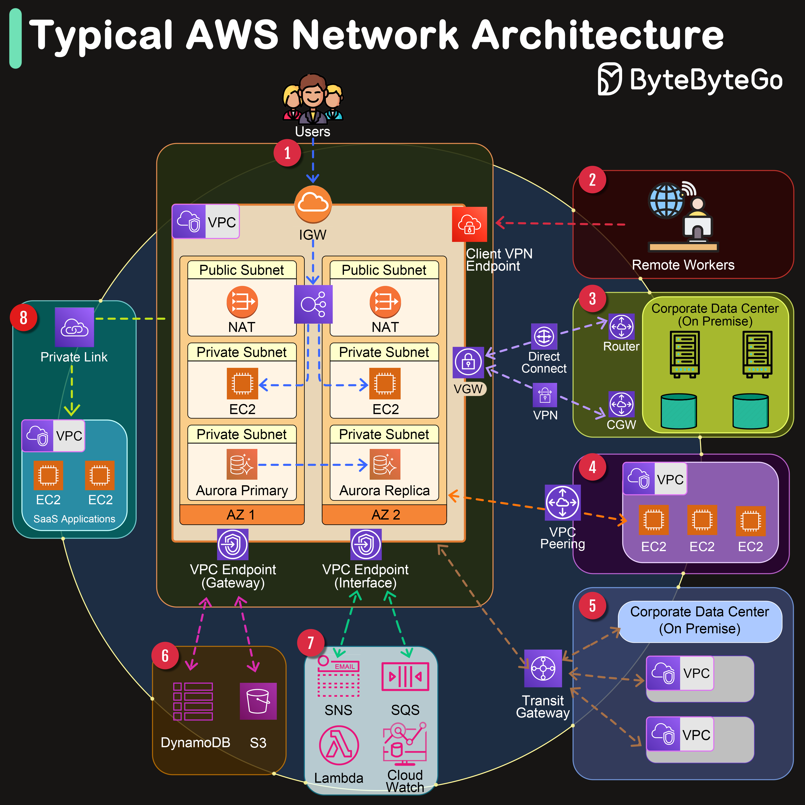

# ☁️ AWS典型网络架构一图看懂！8种连接方式

> VPC、AZ、IGW、VPN、Peering……全覆盖

AWS 的网络架构组件很多，一张图帮你理清 👇

📌 **核心组件：**
- **VPC** — 逻辑隔离的虚拟网络
- **AZ** — 可用区，独立的数据中心

📌 **8种网络连接：**
1️⃣ **Internet Gateway** — VPC连接互联网的大门
2️⃣ **Client VPN** — 远程办公人员安全接入
3️⃣ **Virtual Gateway** — 企业数据中心通过VPN连接VPC
4️⃣ **VPC Peering** — 两个VPC之间的私有连接
5️⃣ **Transit Gateway** — 网络中转枢纽，连接多个VPC和VPN
6️⃣ **VPC Endpoint (Gateway)** — 私有连接到AWS服务（如S3）
7️⃣ **VPC Endpoint (Interface)** — 通过PrivateLink私有连接
8️⃣ **PrivateLink** — 安全访问SaaS应用

💡 理解这些网络组件是使用AWS的基础。收藏这张图，搭网络架构时参考。

你最常用的AWS网络组件是哪个？👇

---

#AWS #网络架构 #VPC #云计算 #架构 #后端 #运维
