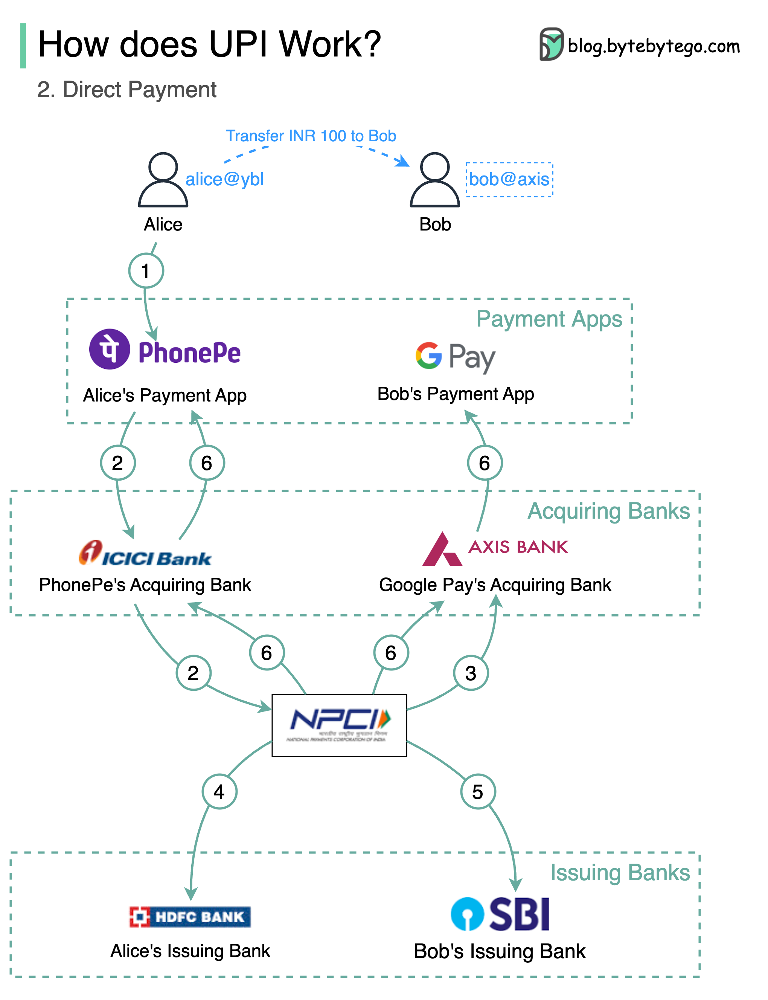

# 💸 印度UPI支付系统是怎么工作的？实时转账的典范

> 占印度60%数字零售交易，其他国家值得学习

印度的 UPI 是全球最成功的实时支付系统之一，来看看它怎么运作 👇

📌 **注册流程：**
1. 提供手机号 → OTP验证
2. 设置VPA（虚拟支付地址，如 bob@axis）
3. 支付App通过收单银行创建VPA

📌 **绑定银行账户：**
1. 用VPA关联银行账户
2. NPCI（国家支付公司）作为收单银行和发卡银行之间的交换机
3. 设置PIN用于二次验证

📌 **直接转账：**
1. Alice输入Bob的UPI ID和金额
2. 请求通过收单银行→NPCI→发卡银行
3. NPCI从Alice账户扣款，向Bob账户加款
4. 成功后通知双方的支付App

💡 UPI的核心设计：VPA解耦了银行账号、统一的NPCI交换层、实时清算。这个架构值得其他国家参考。

你用过类似的实时支付系统吗？👇

---

#UPI #支付 #FinTech #印度 #实时支付 #系统设计 #架构
