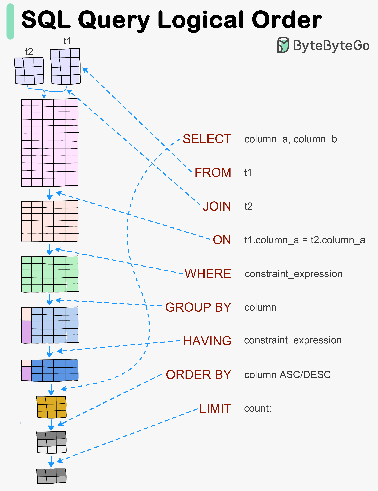

# 🔍 一条SQL是怎么被执行的？可视化执行过程

> 解析→转换→优化→执行，4步搞定

你写的SQL语句，数据库是怎么执行的？👇

📌 **Step 1 — 解析**
解析SQL语句，检查语法是否正确

📌 **Step 2 — 转换**
把SQL转换成内部表示（如关系代数）

📌 **Step 3 — 优化**
优化内部表示，利用索引信息生成执行计划

📌 **Step 4 — 执行**
按执行计划执行，返回结果

💡 理解SQL的执行顺序对写出高效查询很重要。逻辑顺序是：FROM → WHERE → GROUP BY → HAVING → SELECT → ORDER BY → LIMIT

你知道为什么WHERE比HAVING快吗？👇

---

#SQL #数据库 #查询优化 #后端 #面试 #MySQL #程序员
