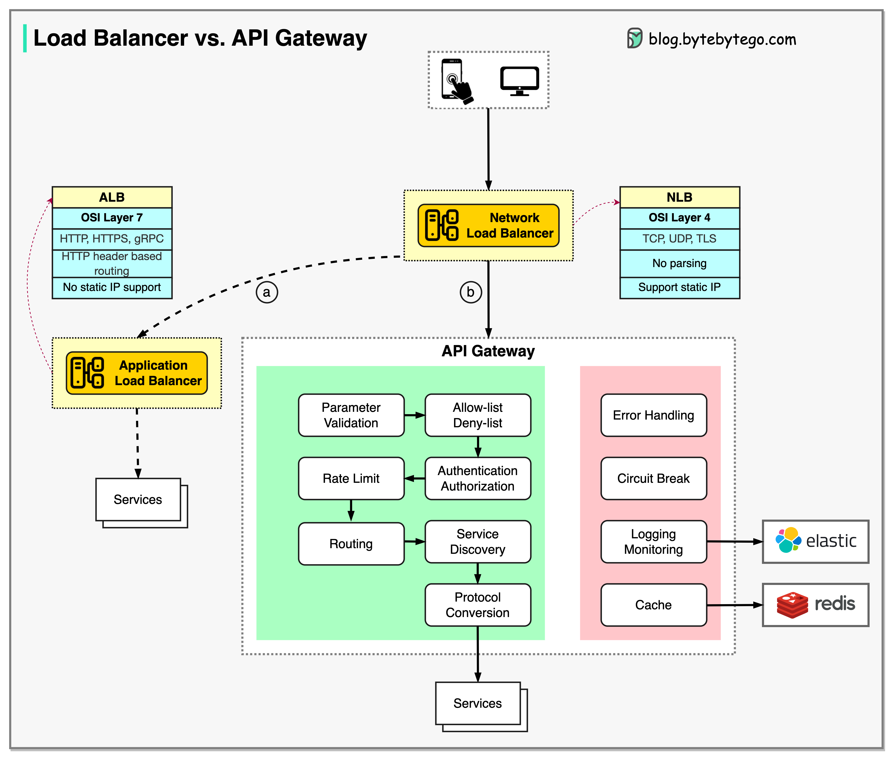

# ⚖️ 负载均衡器 vs API网关！到底有什么区别？

> NLB看IP，ALB看HTTP，API网关管应用层

负载均衡器和API网关经常一起用，但职责不同 👇

📌 **NLB（网络负载均衡）** — 基于IP路由，不解析HTTP请求，部署在API网关前面
📌 **ALB（应用负载均衡）** — 基于HTTP头或URL路由，规则更丰富
📌 **API网关** — 应用层任务：认证、限流、缓存等

📌 **两种组合方案：**
- **方案A：ALB + 服务** — ALB分发请求，每个服务自己实现限流、认证。更灵活但服务层工作量大
- **方案B：ALB + API网关 + 服务** — API网关统一处理认证、限流、缓存。服务层更轻但灵活性稍低

💡 小规模用一个负载均衡器就够了，大规模建议 LB + API网关组合使用。

你们用的哪种方案？👇

---

#负载均衡 #API网关 #架构 #系统设计 #后端 #面试 #程序员
