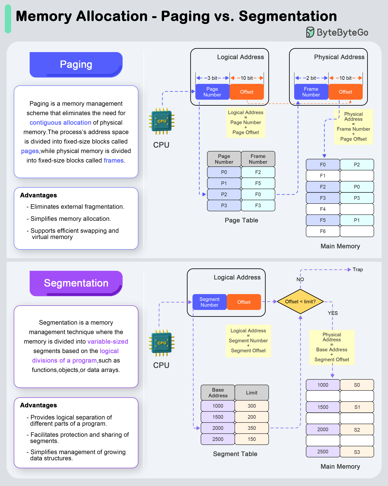

# 🧩 分页 vs 分段！两种内存管理方式对比

> 一个固定大小，一个按逻辑划分

操作系统的两种内存管理方式 👇

📌 **分页（Paging）**
- 地址空间分成固定大小的页，物理内存分成等大的帧
- 地址翻译：逻辑地址 → 页号+偏移 → 查页表 → 帧号+偏移 → 物理地址
- ✅ 消除外部碎片、简化内存分配、支持虚拟内存

📌 **分段（Segmentation）**
- 按程序逻辑划分（函数、对象、数组），大小可变
- 地址翻译：逻辑地址 → 段号+偏移 → 查段表 → 基地址+偏移 → 物理地址
- ✅ 逻辑分离、便于保护和共享、适合动态增长的数据结构

💡 现代操作系统通常结合使用分页和分段（如x86的段页式管理）。

你能解释虚拟内存是怎么工作的吗？👇

---

#操作系统 #内存管理 #分页 #分段 #计算机基础 #面试 #程序员
