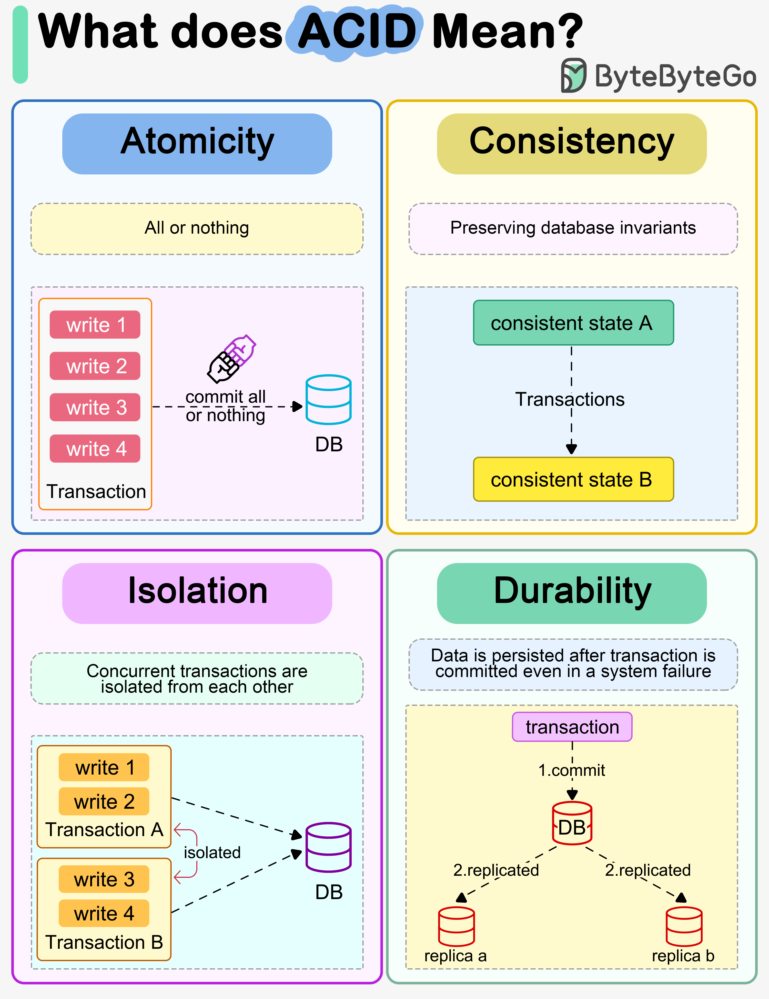

# 💎 ACID是什么意思？数据库事务四大特性

> 原子性、一致性、隔离性、持久性

数据库事务的4个核心特性 👇

📌 **Atomicity（原子性）** — 事务中的写操作要么全部执行，要么全部回滚。"全有或全无"

📌 **Consistency（一致性）** — 事务写入的数据必须满足所有定义的规则，保持数据库在合法状态。注意：这里的一致性和CAP定理里的不一样

📌 **Isolation（隔离性）** — 并发事务互相隔离。最严格的是串行化，但实际中常用更宽松的隔离级别

📌 **Durability（持久性）** — 事务提交后数据持久保存，即使系统故障也不丢失。分布式系统中意味着数据复制到多个节点

💡 ACID 是关系型数据库的基石，NoSQL 通常只保证部分特性（BASE模型）。面试必考。

你能解释 ACID 和 BASE 的区别吗？👇

---

#ACID #数据库 #事务 #MySQL #后端 #面试 #程序员
