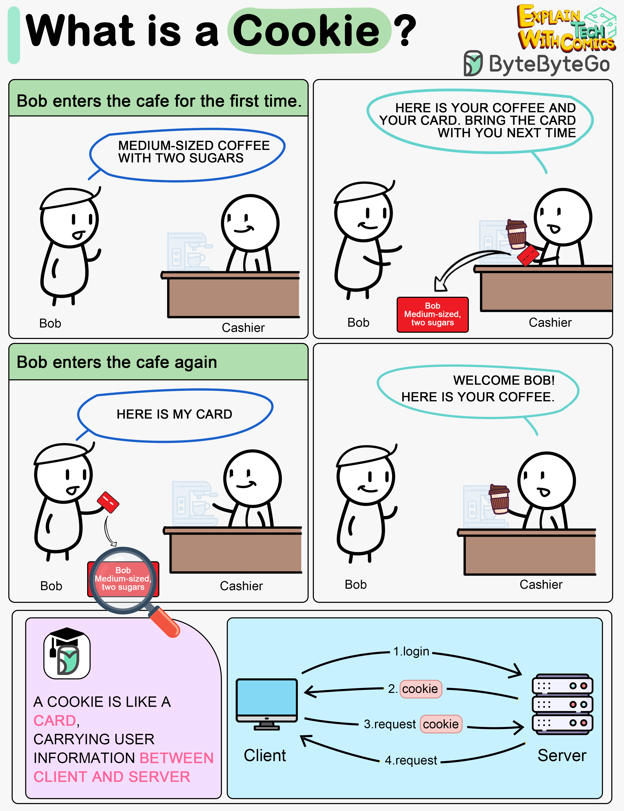

# 🍪 Cookie是什么？用咖啡店的故事秒懂

> 服务器给你的"偏好卡"，下次来就认识你了

用一个故事解释Cookie 👇

📌 Bob第一次去咖啡店，点了中杯双糖浓缩。收银员把Bob的身份和偏好记在一张卡上，连同咖啡一起给Bob

📌 下次Bob再来，出示偏好卡，收银员立刻知道他是谁、喜欢什么咖啡

📌 **Cookie就是这张偏好卡：**
- 登录网站时，服务器发给你一个Cookie
- Cookie存在客户端（浏览器）
- 下次请求时自动带上Cookie
- 服务器不用查数据库就知道你是谁

💡 Cookie 让无状态的HTTP变得"有记忆"。但要注意安全属性的设置（HttpOnly、Secure、SameSite）。

你理解Cookie和Session的区别吗？👇

---

#Cookie #Web #HTTP #前端 #安全 #面试 #程序员
