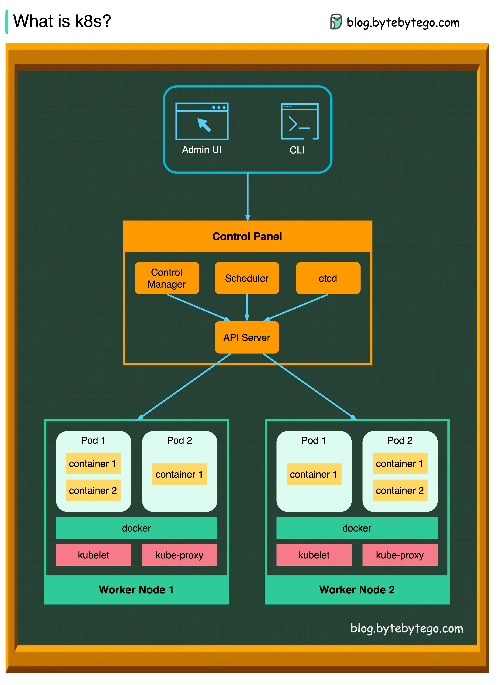

# ☸️ Kubernetes（K8s）是什么？容器编排之王！

> 一张图搞懂K8s架构，控制面板+工作节点全解析

Docker会了，下一步就是 **Kubernetes** 👇

📌 **K8s是什么？**
- **容器编排系统**，用于容器的部署和管理
- 设计深受Google内部系统 **Borg** 的影响
- 一个K8s集群 = **控制平面** + **工作节点**

🧠 **控制平面组件（Control Plane）：**

1️⃣ **API Server**
- K8s的"大脑"，所有组件都通过它通信
- 对Pod的所有操作都要经过API Server

2️⃣ **Scheduler（调度器）**
- 监控Pod的工作负载
- 把新创建的Pod**分配到合适的节点**

3️⃣ **Controller Manager（控制器管理器）**
- 运行各种控制器：Node Controller、Job Controller等
- 确保集群状态符合预期

4️⃣ **etcd**
- **键值存储**数据库
- 保存K8s集群的所有配置和状态数据

⚙️ **工作节点组件（Nodes）：**

1️⃣ **Pod**
- K8s管理的**最小单元**
- 一组容器的集合，共享同一个IP地址

2️⃣ **Kubelet**
- 运行在每个节点上的**代理**
- 确保容器在Pod中正常运行

3️⃣ **Kube Proxy**
- 每个节点上的**网络代理**
- 负责将流量路由到正确的容器

💡 K8s让容器管理从手动变自动，是云原生时代的基础设施核心。学会它，运维效率翻倍！

你们生产环境用K8s了吗？踩过什么坑？👇

---

#Kubernetes #K8s #容器 #Docker #云原生 #DevOps #后端 #运维
