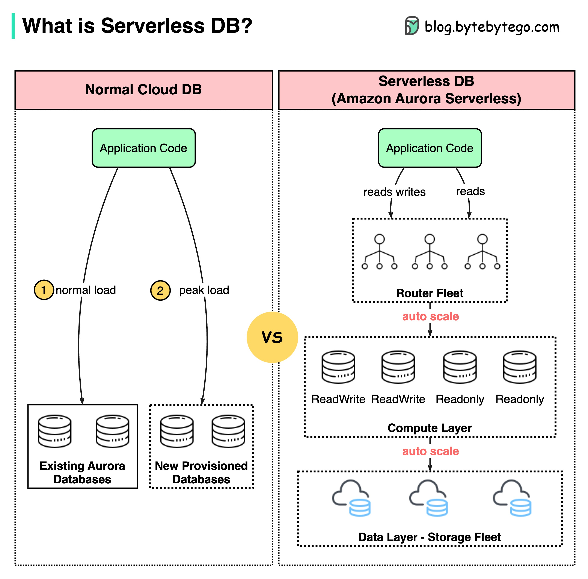

# 🗄️ Serverless数据库是什么？数据库也能按需付费了！

> 不用管服务器，自动扩缩容，用多少付多少

还在手动扩容数据库？来看看 **Serverless DB** 👇

📌 **Serverless数据库是什么？**
- 不需要手动管理数据库实例
- 自动**启动、关闭、扩缩容**
- 以 **Amazon Aurora Serverless** 为代表

🔥 **Aurora Serverless的核心特性：**

1️⃣ **自动弹性伸缩**
- 根据业务需求**自动调整容量**
- 电商大促？几毫秒内扩展到多个数据库实例
- 流量低谷？自动缩容，省钱！

2️⃣ **计算与存储分离**
- **计算层**和**数据存储层**解耦
- 计费更精确，不用为闲置资源买单

3️⃣ **混合部署**
- 可以把**预置实例**和**Serverless实例**组合使用
- 现有数据库也能加入Serverless池

💡 **对比传统云数据库：**
- 传统方式：需要**预先配置**和**管理**数据库实例
- Serverless：全自动，**用多少付多少**

Serverless数据库特别适合**流量波动大**、**开发测试环境**、**不确定负载**的场景。不用再为数据库容量规划头疼了！

你觉得Serverless数据库会成为未来主流吗？👇

---

#Serverless #数据库 #Aurora #AWS #云计算 #后端 #架构
