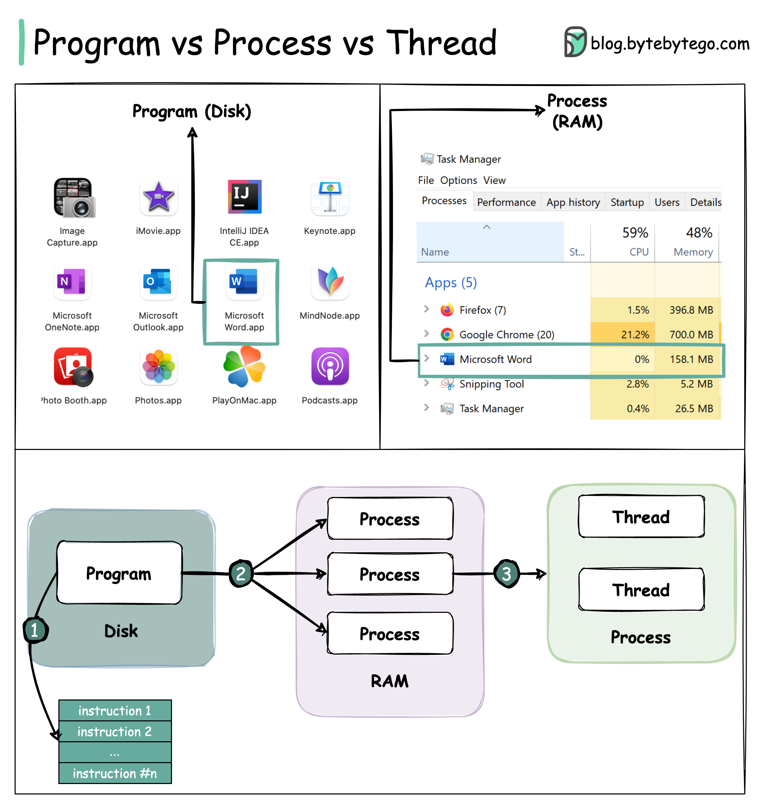

# 🧵 进程和线程到底有什么区别？一图讲清楚！

> 程序、进程、线程三者的关系，面试高频考点

面试官问：进程和线程有什么区别？别慌，看这里 👇

📌 **先搞清三个概念：**

🔹 **程序（Program）**
- 存储在磁盘上的**可执行文件**
- 包含一组指令，是**静态**的

🔹 **进程（Process）**
- 程序被加载到内存中**运行起来**就是进程
- 一个程序可以有**多个进程**（比如Chrome每个标签页就是一个进程）
- 需要寄存器、程序计数器、栈等资源

🔹 **线程（Thread）**
- 进程中**最小的执行单元**
- 一个进程可以有多个线程
- 比如Word里，一个线程负责**拼写检查**，另一个负责**文字输入**

🔄 **三者的关系：**
1️⃣ 程序包含一组指令
2️⃣ 程序加载到内存，变成一个或多个进程
3️⃣ 进程启动后分配内存和资源，可以创建多个线程

⚡ **进程 vs 线程的核心区别：**
- 🏠 进程通常**相互独立**，线程是进程的**子集**
- 💾 每个进程有**独立的内存空间**，同一进程的线程**共享内存**
- ⏱️ 进程是**重量级操作**，创建和销毁更耗时
- 🔄 进程间**上下文切换**开销更大
- 💬 线程间通信比进程间通信**更快**

💡 简单记：进程是"独栋别墅"，线程是"合租室友"。别墅之间互不干扰，室友之间共享客厅和厨房。

你还知道协程（Coroutine）吗？评论区聊聊！👇

---

#进程 #线程 #操作系统 #面试 #计算机基础 #并发 #后端开发
