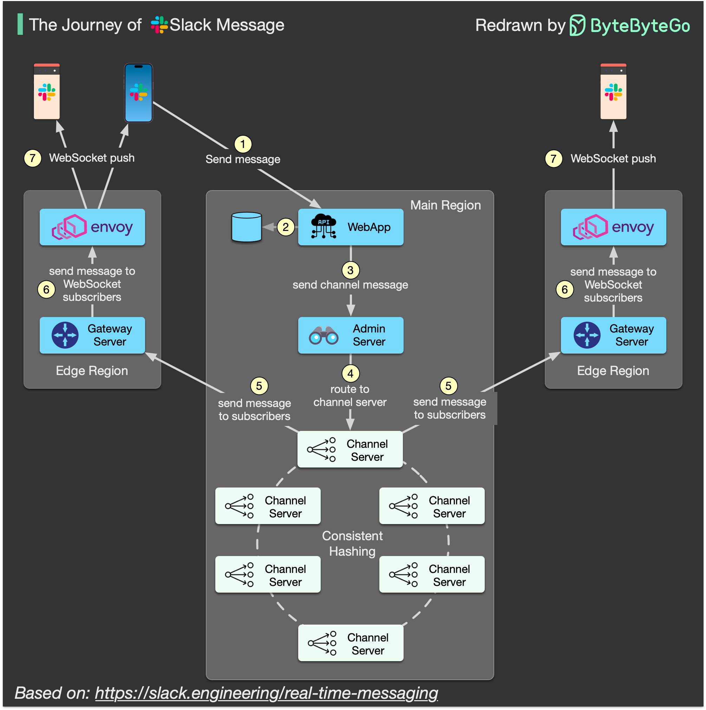

# 💬 一条Slack消息的旅程：从发送到接收经历了什么？

> 5个关键服务器 + 一致性哈希 + WebSocket，揭秘实时消息架构

你发一条Slack消息，对方秒收到。这背后发生了什么？👇

📌 **Slack消息经过的5个关键服务器：**

1️⃣ **WebApp**
- 定义Slack客户端使用的**API接口**
- 消息的入口

2️⃣ **Admin Server（AS）**
- 根据频道ID找到**正确的Channel Server**
- 相当于"路由导航"

3️⃣ **Channel Server（CS）**
- 维护消息频道的**历史记录**
- 使用**一致性哈希**将数百万频道分配到多台服务器

4️⃣ **Gateway Server（GS）**
- 部署在每个**地理区域**
- 维护 **WebSocket** 频道订阅

5️⃣ **Envoy**
- 云原生应用的**服务代理**
- 负责流量转发

🔄 **消息传递流程：**
- 📤 消息通过 WebApp → Admin Server → **正确的Channel Server**
- 📥 Channel Server 通过 Gateway Server + Envoy → **推送给接收者**
- 🔗 接收者使用 **WebSocket**（双向通信），实时收到消息更新

💡 **关键技术点：**
- **一致性哈希** — 解决海量频道的分配问题
- **WebSocket** — 双向通信，消息实时推送
- **Envoy代理** — 云原生服务间的高效通信

Slack的架构设计真的很精妙，值得学习！

你平时用Slack还是飞书/钉钉？👇

---

#Slack #系统设计 #消息架构 #WebSocket #一致性哈希 #后端 #架构设计
