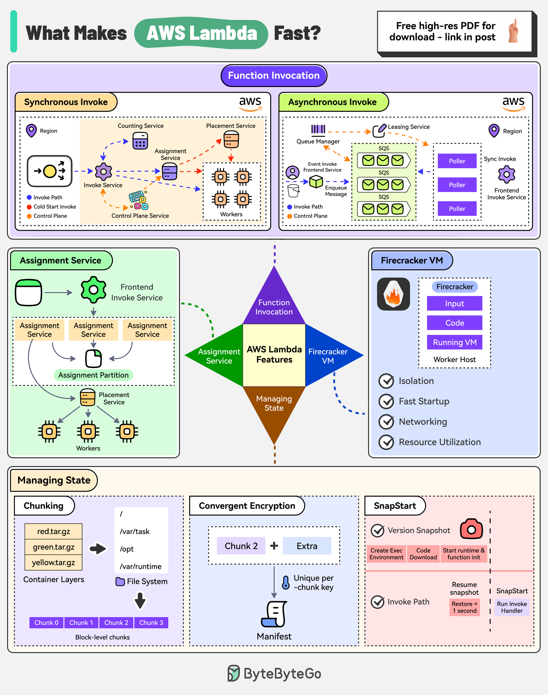

# ⚡ AWS Lambda为什么这么快？4大核心支柱

> Firecracker微虚拟机+零拷贝+Rust高性能

AWS Lambda 的速度靠这4个支柱 👇

📌 **函数调用** — 支持同步和异步调用。异步调用通过内部SQS队列解耦
📌 **Assignment Service** — 用Rust编写，管理执行环境，分区+主从架构保证高可用
📌 **Firecracker微虚拟机** — 轻量级VM管理器，用Linux KVM创建安全快速启动的微VM
📌 **组件存储** — 分块存储容器镜像、收敛加密保护共享数据、SnapStart预初始化减少冷启动

💡 Firecracker 是 Lambda 速度的关键，它让每个函数都运行在独立的微VM中，既安全又快速。

你用过 Lambda 吗？冷启动问题怎么解决的？👇

---

#AWSLambda #Serverless #Firecracker #云计算 #后端 #架构 #面试
