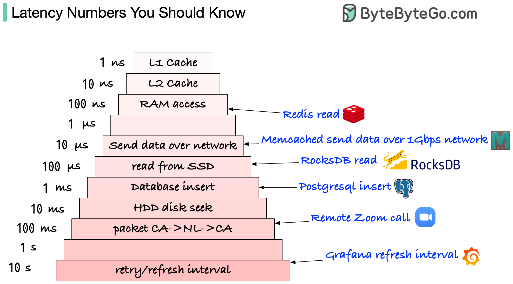

# ⏱️ 程序员必知的延迟数字！从1ns到100ms

> 知道这些数字，系统设计才有感觉

这些延迟数字每个程序员都该记住 👇

📌 **L1/L2 Cache** — 1ns / 10ns（CPU内部）
📌 **RAM访问** — 100ns（Redis读取约这个速度）
📌 **1KB数据通过1Gbps网络** — 10μs（Memcached网络传输）
📌 **SSD读取** — 100μs（RocksDB读取延迟）
📌 **数据库插入** — 1ms（PostgreSQL提交）
📌 **跨大西洋往返** — 100ms（长距离Zoom通话）
📌 **刷新间隔** — 1-10s（Grafana默认5-10秒）

📌 **单位换算：**
1ns = 10⁻⁹秒 | 1μs = 1000ns | 1ms = 1000μs

💡 记住这些数字能帮你在系统设计时快速判断瓶颈在哪里。面试加分项。

你能背出几个？👇

---

#延迟 #性能 #系统设计 #面试 #后端 #Redis #程序员
