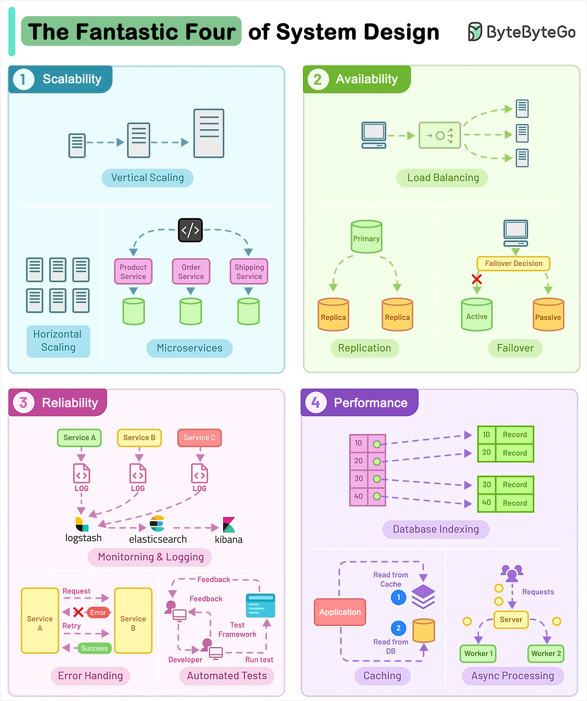

# 🦸 系统设计四大天王！扩展性、可用性、可靠性、性能

> 构建成功软件系统的4个核心维度

系统设计最关键的4个维度 👇

📌 **Scalability（扩展性）** — 应用能处理更多负载而不影响性能
📌 **Availability（可用性）** — 应用随时可用，停机时间最少
📌 **Reliability（可靠性）** — 软件持续交付正确的结果
📌 **Performance（性能）** — 在峰值负载下用可用资源完成任务的能力

💡 这四个维度是系统设计面试的核心框架。每个设计决策都要从这4个角度评估。

你觉得哪个最难实现？👇

---

#系统设计 #扩展性 #高可用 #性能 #面试 #架构 #后端
