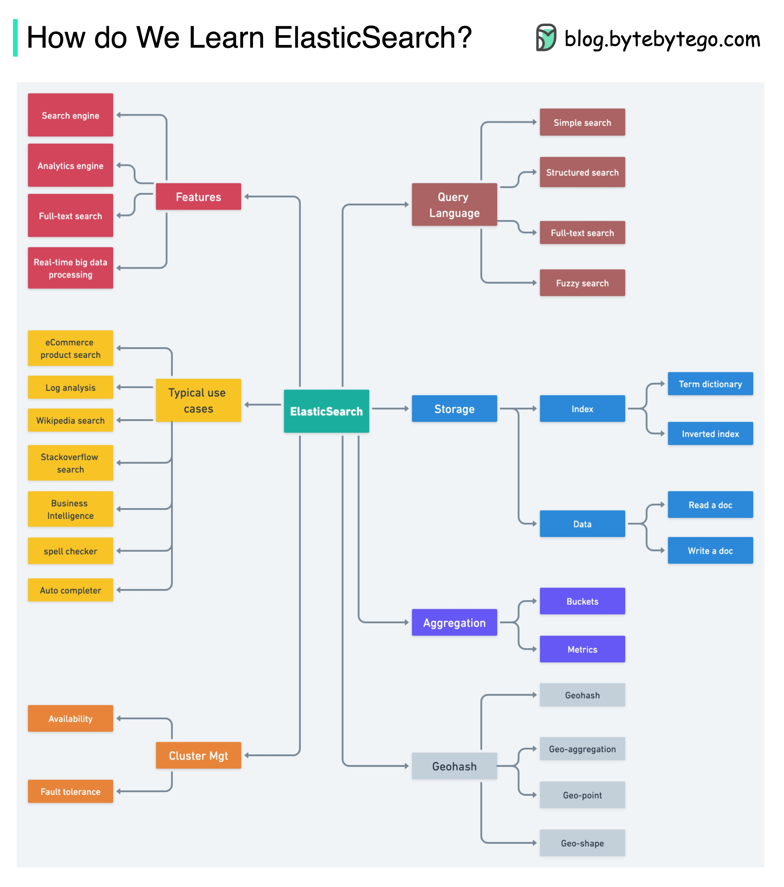

# 🔍 Elasticsearch学习指南

> 电商搜索、日志分析、全文检索都靠它

基于Lucene的Elasticsearch，提供分布式全文搜索能力 👇

📌 **核心特性**
- 实时全文搜索
- 分析引擎
- 分布式Lucene

📌 **使用场景**
- 电商网站商品搜索
- 日志分析
- 自动补全、拼写检查
- 商业智能分析
- Wikipedia全文搜索
- StackOverflow全文搜索

📌 **核心原理**
ES的核心在于数据结构和索引，关键是理解它如何用LSM Tree构建词典（Term Dictionary）

💡 学ES的路径：先理解倒排索引原理，再学查询DSL，最后学集群管理和性能调优。

---

#Elasticsearch #搜索引擎 #后端开发 #程序员 #大数据 #技术干货
