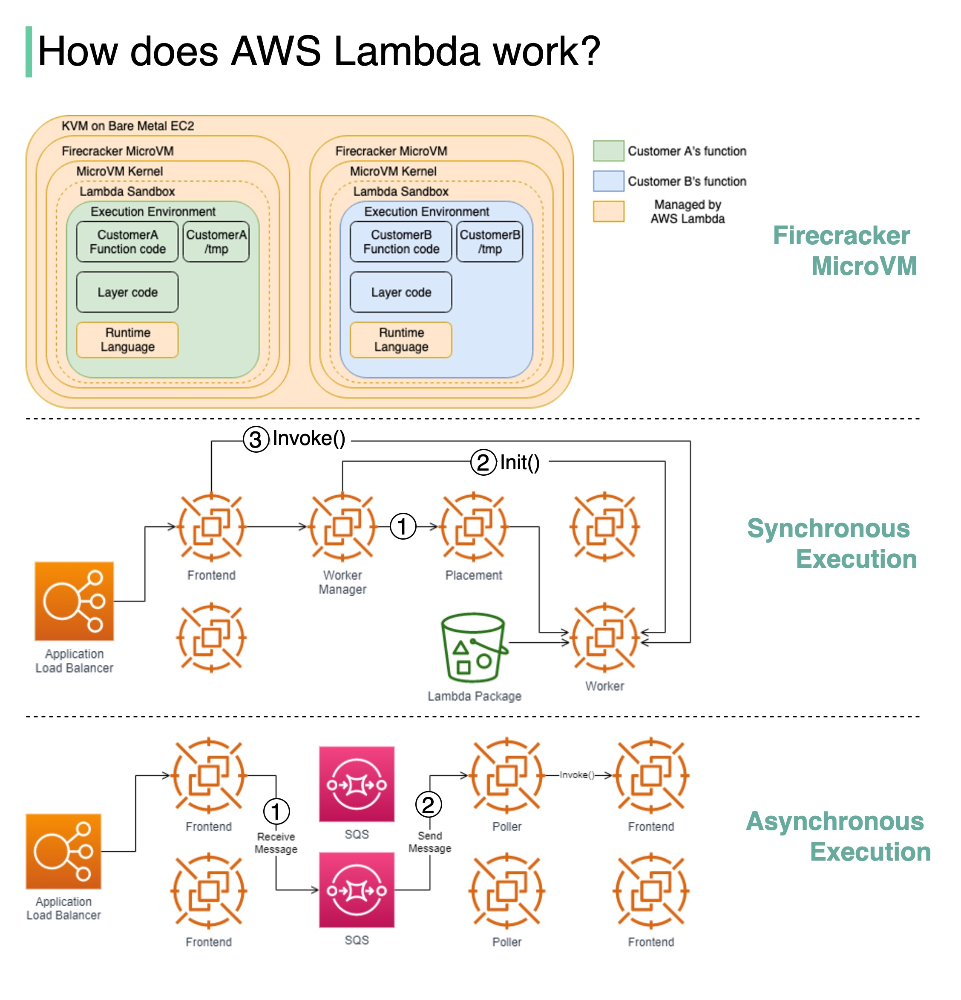

# ⚡ AWS Lambda幕后原理

> Firecracker微虚拟机是Lambda的引擎

Lambda是AWS的Serverless计算服务，背后由Firecracker（Rust编写的虚拟化技术）驱动 👇

📌 **隔离模型**
Lambda函数运行在沙箱中，提供最小Linux用户空间。在EC2实例上创建执行环境

📌 **同步执行**
1. Worker Manager与Placement Service通信，配置沙箱
2. 调用Init初始化函数（从S3下载Lambda包，设置运行时）
3. Frontend Worker调用Invoke执行

📌 **异步执行**
1. ALB将调用转发到Frontend，事件放入内部SQS队列
2. Poller从队列拉取事件，同步转发到Frontend，后续走同步流程

💡 Lambda的冷启动就是Init阶段的耗时。预热（Provisioned Concurrency）可以消除冷启动。

---

#AWSLambda #Serverless #云计算 #程序员 #后端开发 #技术干货
