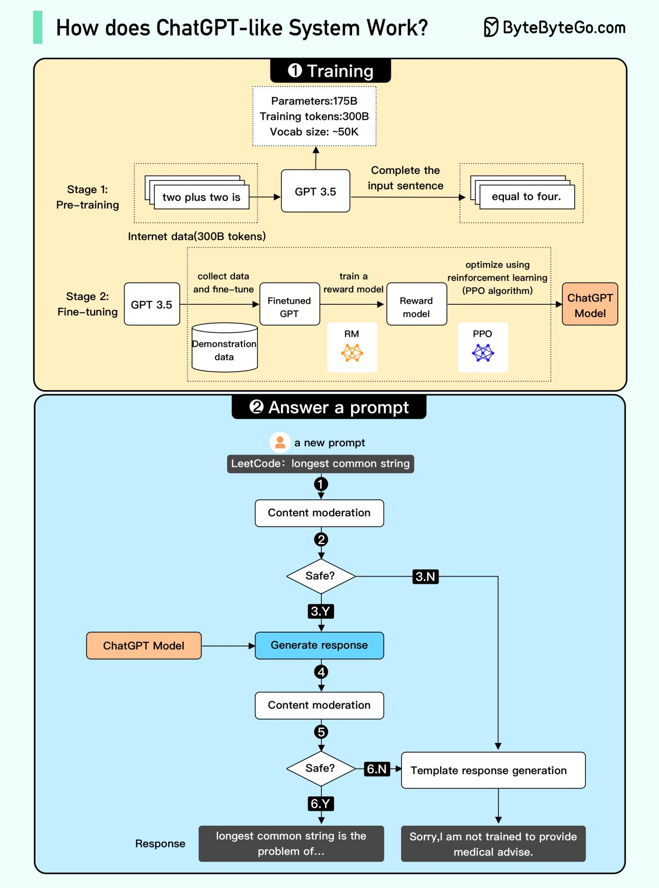

# 🤖 ChatGPT是怎么工作的

> 从预训练到RLHF，ChatGPT的完整技术栈

ChatGPT的工作分为训练和回答两部分 👇

📌 **训练阶段**

预训练：在大量互联网数据上训练GPT模型（decoder-only transformer），学会预测下一个词。此时能补全句子但不能回答问题

微调（3步）：
1. 收集问答数据，微调预训练模型
2. 收集多个答案，训练奖励模型排序答案质量
3. 用强化学习（PPO）优化模型，让答案更准确

📌 **回答流程**
1. 用户输入问题
2. 内容审核检查是否违规
3-4. 通过审核则发送给模型生成回答
5-6. 回答再次经过内容审核
7. 通过则展示给用户，否则返回模板回答

💡 ChatGPT的核心创新是RLHF（人类反馈强化学习），让模型的回答更符合人类期望。

---

#ChatGPT #AI #大模型 #深度学习 #程序员 #技术干货
