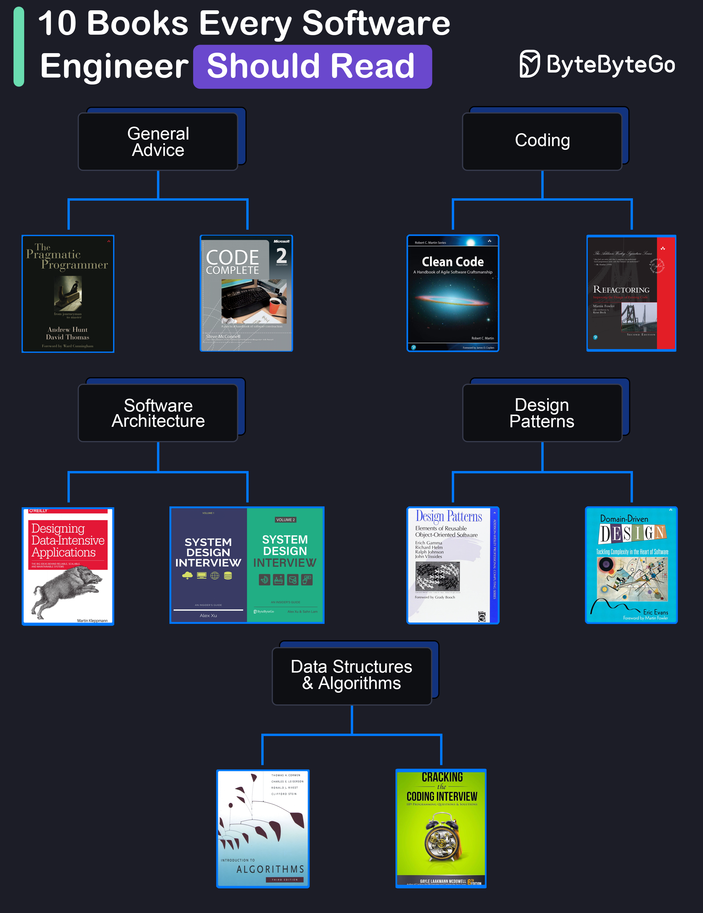

# 📚 程序员必读的10本书！从入门到架构师的进阶书单

> 收藏这份书单，少走三年弯路

想成为更好的开发者？这10本书是业界公认的经典，按方向分类给你整理好了 👇

📖 **通用建议**
- 《程序员修炼之道》— 编程思维的启蒙之作
- 《代码大全》— 被称为软件开发的"圣经"，从设计到测试全覆盖

📖 **编码能力**
- 《代码整洁之道》— Bob大叔教你写出优雅代码
- 《重构》— Martin Fowler 的经典，教你如何改善既有代码

📖 **软件架构**
- 《数据密集型应用系统设计》(DDIA) — 后端工程师的必读神书
- 《系统设计面试》— 面试+实战两不误

📖 **设计模式**
- 《设计模式》(GoF) — 四人帮的经典之作
- 《领域驱动设计》— 复杂业务建模的指南

📖 **数据结构与算法**
- 《算法导论》— 算法领域的权威教材
- 《Cracking the Coding Interview》— 刷题面试必备

💡 建议：不用一次全读，根据当前阶段选2-3本深入研读，比泛读10本更有效。

你读过哪几本？评论区分享下读后感 👇

---

#程序员 #技术书单 #软件开发 #编程 #程序员成长 #代码 #架构师 #面试 #计算机
