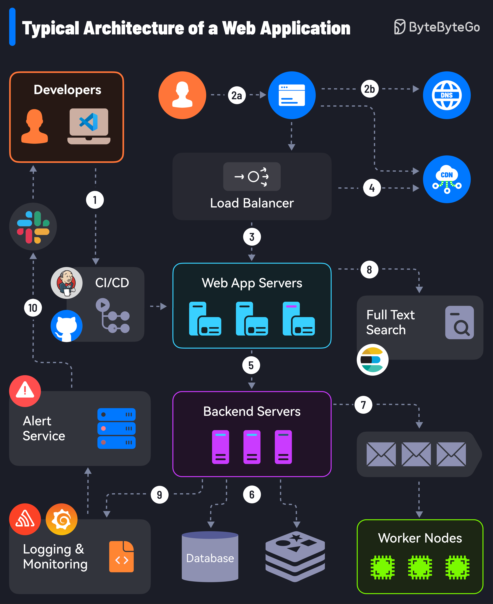

# 🌐 生产级Web应用的10大核心组件！一张图看懂完整架构

> 你的Web应用上线前，这10个组件缺一不可

一个真正能上线的Web应用，远不止写几个页面那么简单。来看看完整的生产架构需要哪些组件 👇

1️⃣ **CI/CD 流水线** — 用 Jenkins、GitHub Actions 自动化部署代码到服务器

2️⃣ **DNS 解析** — 用户在浏览器输入网址后，请求经过DNS解析到达应用服务器

3️⃣ **负载均衡 & 反向代理** — Nginx、HAProxy 把请求均匀分发到多台服务器

4️⃣ **CDN 内容分发** — 静态资源就近分发，加速用户访问

5️⃣ **API 通信** — Web应用通过API与后端服务交互

6️⃣ **数据库 & 缓存** — 后端服务连接数据库或分布式缓存获取数据

7️⃣ **任务队列** — 耗时任务丢给 Job Worker 异步处理

8️⃣ **全文搜索** — Elasticsearch、Solr 支撑搜索功能

9️⃣ **监控系统** — Sentry、Grafana、Prometheus 收集日志和指标

🔟 **告警服务** — 出问题时通过 Slack 等平台通知开发者快速响应

💡 这10个组件构成了现代Web应用的骨架，理解它们的协作方式是成为全栈工程师的关键。

---

#Web开发 #系统架构 #程序员 #后端开发 #技术干货 #全栈 #DevOps #微服务
