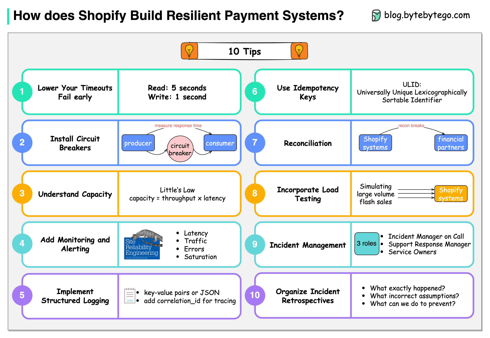

# 💰 Shopify支付系统的10条生存法则！大厂实战经验

> 支付系统容不得半点马虎，来看Shopify怎么做的

支付系统是最不能出错的系统之一。Shopify 总结了10条构建高可用支付系统的宝贵经验 👇

1️⃣ **降低超时时间，快速失败** — 默认60秒太长了！读超时5秒、写超时1秒更合理

2️⃣ **安装熔断器** — Shopify 开发了 Semian 来保护 HTTP、MySQL、Redis、gRPC 服务

3️⃣ **容量管理** — 50个请求 × 100ms处理时间 = 500 QPS 吞吐量，心里要有数

4️⃣ **监控和告警** — Google SRE 四大黄金指标：延迟、流量、错误率、饱和度

5️⃣ **结构化日志** — 集中存储，方便搜索和排查

6️⃣ **使用幂等键** — 用 ULID 代替 UUID v4，保证操作不重复

7️⃣ **对账一致性** — 与金融合作伙伴的对账差异存入数据库

8️⃣ **负载测试** — 定期模拟大促场景，获取基准数据

9️⃣ **事件管理** — 每个事件频道3个角色：IMOC、SRM、服务负责人

🔟 **事后复盘** — 三个灵魂拷问：发生了什么？我们的错误假设是什么？如何防止再次发生？

💡 这些原则不只适用于支付系统，任何对可靠性要求高的系统都值得参考。

---

#支付系统 #Shopify #系统设计 #高可用 #程序员 #后端开发 #技术干货 #架构
