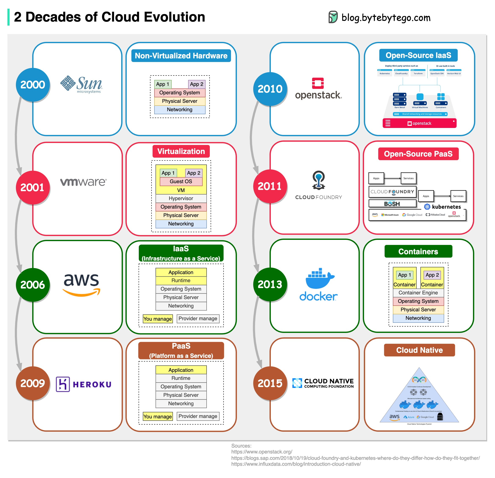

# ☁️ 云计算20年进化史！从虚拟机到云原生的蜕变之路

> 一张图带你看懂云计算是怎么一步步走到今天的

IaaS、PaaS、云原生……这些词天天听，但云计算到底是怎么演变过来的？

来，跟着时间线走一遍 👇

📌 **2001年 - VMware**
虚拟化技术登场！通过 Hypervisor 实现虚拟机，一台物理机可以跑多个系统，资源利用率直接起飞 🚀

📌 **2006年 - AWS**
亚马逊推出 IaaS（基础设施即服务），不用自己买服务器了，按需租用，云计算时代正式开启 ☁️

📌 **2009年 - Heroku**
PaaS（平台即服务）来了！开发者只管写代码，部署运维的事交给平台，开发效率拉满 💻

📌 **2010年 - OpenStack**
开源版 IaaS 诞生，企业可以自己搭私有云，不用被大厂绑定 🔓

📌 **2011年 - Cloud Foundry**
开源版 PaaS 上线，给企业更多平台选择 🛠️

📌 **2013年 - Docker**
容器技术横空出世！比虚拟机更轻量、启动更快，彻底改变了应用打包和部署的方式 📦

📌 **2015年 - CNCF**
云原生计算基金会成立，Kubernetes 等项目开始主导云计算的未来，云原生时代全面到来 🌐

---

💡 一句话总结：从虚拟机 → IaaS → PaaS → 容器 → 云原生，每一步都在让开发者更专注于业务本身，基础设施越来越"隐形"。

你现在用的是哪个阶段的技术栈？评论区聊聊 👇

---

#云计算 #程序员 #技术干货 #云原生 #Docker #AWS #后端开发 #架构师 #科技 #互联网
