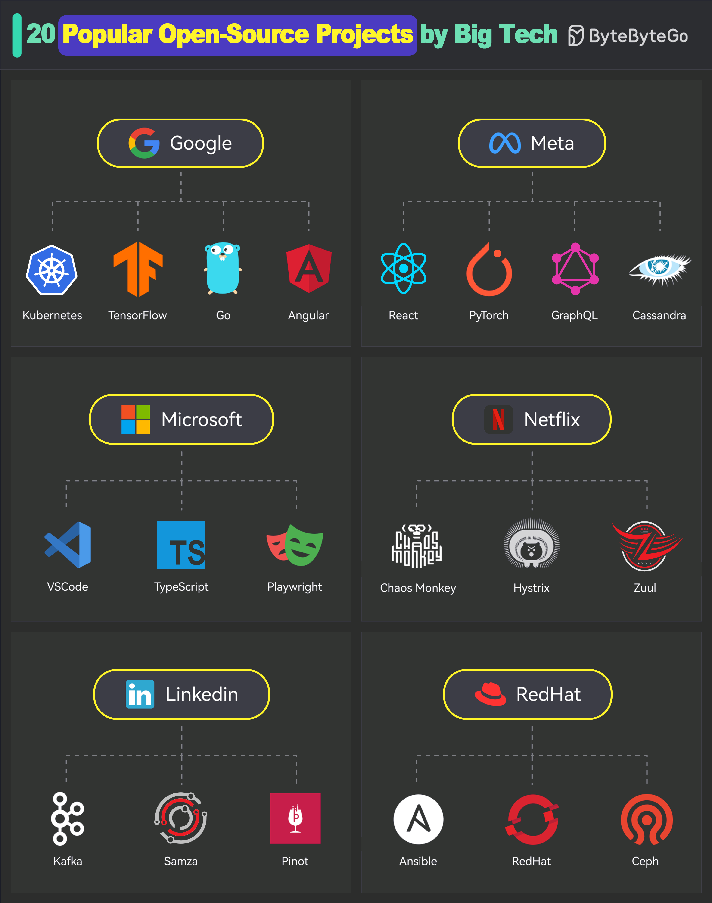

# 🏢 大厂开源的20个顶级项目！看看你用过几个

> Google、Meta、微软、Netflix……大厂的开源贡献远超你想象

你每天用的工具，很多都是大厂开源的 👇

🔵 **Google**
- Kubernetes — 容器编排之王
- TensorFlow — 机器学习框架
- Go — 高性能编程语言
- Angular — 前端框架

🔵 **Meta**
- React — 前端UI库，生态最强
- PyTorch — 深度学习框架
- GraphQL — API查询语言
- Cassandra — 分布式NoSQL数据库

🔵 **Microsoft**
- VS Code — 最受欢迎的代码编辑器
- TypeScript — JS的超集，类型安全
- Playwright — 端到端测试框架

🔴 **Netflix**
- Chaos Monkey — 混沌工程先驱
- Hystrix — 熔断器库
- Zuul — API网关

🔵 **LinkedIn**
- Kafka — 消息队列/流处理平台
- Samza — 流处理框架
- Pinot — 实时分析数据库

🔴 **Red Hat**
- Ansible — 自动化运维工具
- OpenShift — 容器平台
- Ceph — 分布式存储

💡 大厂开源不是做慈善，是通过社区力量让项目更强大，同时吸引人才。

---

#开源 #程序员 #Google #Meta #微软 #技术干货 #Kubernetes #React
