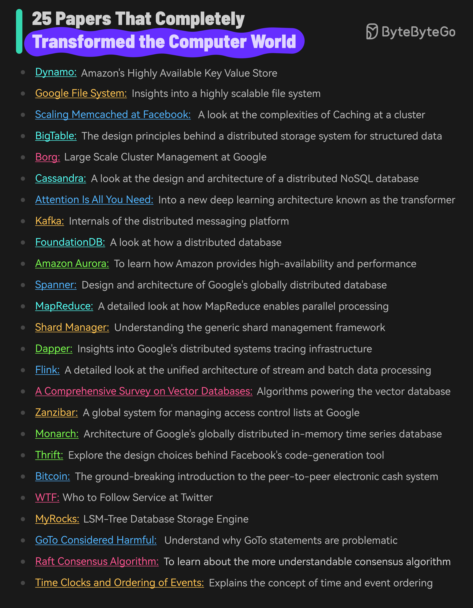

# 📄 改变计算机世界的25篇论文！每篇都是里程碑

> 想深入理解技术本质？读这些论文就对了

这25篇论文塑造了现代计算机科学的面貌 👇

🗄️ **分布式存储**
- Dynamo — Amazon 高可用键值存储
- Google File System — 大规模分布式文件系统
- BigTable — Google 分布式存储系统
- Cassandra — 分布式NoSQL数据库设计
- Amazon Aurora — 高可用高性能云数据库
- Spanner — Google 全球分布式数据库

⚡ **数据处理**
- MapReduce — 大规模并行数据处理
- Kafka — 分布式消息平台
- Flink — 流批一体处理引擎
- Scaling Memcached at Facebook — 大规模缓存实践

🤖 **AI & 新技术**
- Attention Is All You Need — Transformer架构，开启大模型时代
- 向量数据库综述 — AI时代的新型存储
- Bitcoin — 点对点电子现金系统

🔧 **系统 & 基础设施**
- Borg — Google 大规模集群管理
- Raft — 更易理解的共识算法
- Zanzibar — Google 全球访问控制系统
- Dapper — Google 分布式追踪系统
- Time Clocks — Lamport 的时间与事件排序

💡 不用一次全读，选你当前工作相关的领域深入，每篇都值得反复品味。

---

#计算机科学 #论文 #分布式系统 #程序员 #技术干货 #架构师 #AI
