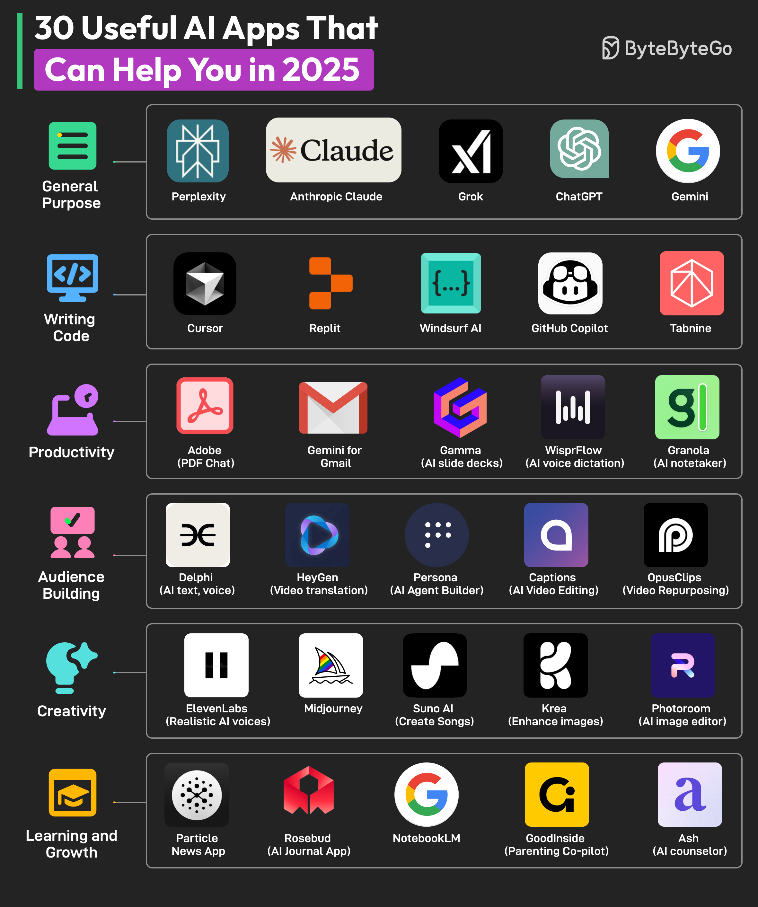

# 🤖 2025年最实用的30个AI应用！效率翻倍神器合集

> 各个领域都有AI神器，总有一款适合你

AI应用已经渗透到方方面面，按场景分类给你整理好了 👇

🧠 **通用AI助手**
- Perplexity — AI搜索引擎
- Claude — Anthropic 的对话AI
- Grok — X平台的AI
- ChatGPT — OpenAI 的王牌
- Gemini — Google 的多模态AI

💻 **写代码**
- Cursor — AI代码编辑器
- Replit — 在线AI编程平台
- Windsurf AI — AI辅助开发
- GitHub Copilot — 代码自动补全
- Tabnine — AI代码助手

📊 **办公效率**
- Adobe PDF Chat — AI读PDF
- Gemini for Gmail — 邮件AI助手
- Gamma — AI做PPT
- WisprFlow — AI语音输入
- Granola — AI会议笔记

📱 **内容创作**
- Delphi — AI文字和语音
- HeyGen — 视频翻译
- Captions — AI视频编辑
- OpusClips — 视频二次创作

🎨 **创意设计**
- ElevenLabs — 逼真AI语音
- Midjourney — AI绘画
- Suno AI — AI音乐生成
- Krea — 图片增强
- Photoroom — AI图片编辑

📚 **学习成长**
- NotebookLM — Google的AI笔记本
- Particle — AI新闻应用
- Rosebud — AI日记

💡 工具只是手段，关键是找到适合自己工作流的那几个，深度使用。

---

#AI #人工智能 #效率工具 #程序员 #ChatGPT #Midjourney #技术干货
