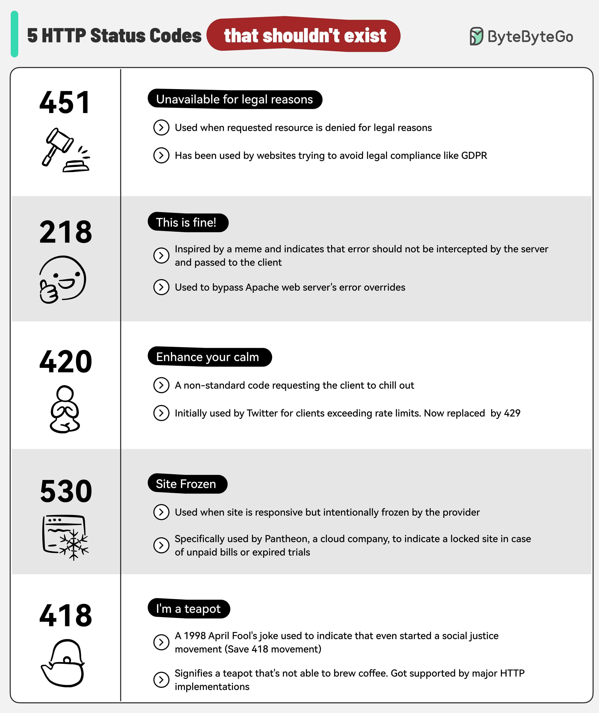

# 😂 这5个HTTP状态码不该被发明！程序员的冷幽默

> 有些状态码纯属整活，但它们真的存在

HTTP状态码里藏着程序员的冷幽默，这5个最离谱 👇

☕ **418 I'm a Teapot** — "我是茶壶"
愚人节玩笑产物，表示服务器是个茶壶，拒绝煮咖啡。居然被保留至今

🔥 **218 This is Fine** — "一切正常"
灵感来自那个"着火了但说没事"的表情包，绕过服务器错误覆盖

😤 **420 Enhance Your Calm** — "冷静一下"
Twitter早期用来告诉你请求太频繁了，后来改成了标准的429

⚖️ **451 Unavailable for Legal Reasons** — "因法律原因不可用"
致敬《华氏451度》，表示内容因法律问题被屏蔽

🥶 **530 Site Frozen** — "网站被冻结"
Pantheon平台专用，通常是因为没交钱……

💡 虽然这些状态码很搞笑，但418已经成了程序员文化的一部分。面试被问到可以拿来活跃气氛。

---

#HTTP #程序员 #编程幽默 #Web开发 #技术干货 #状态码
