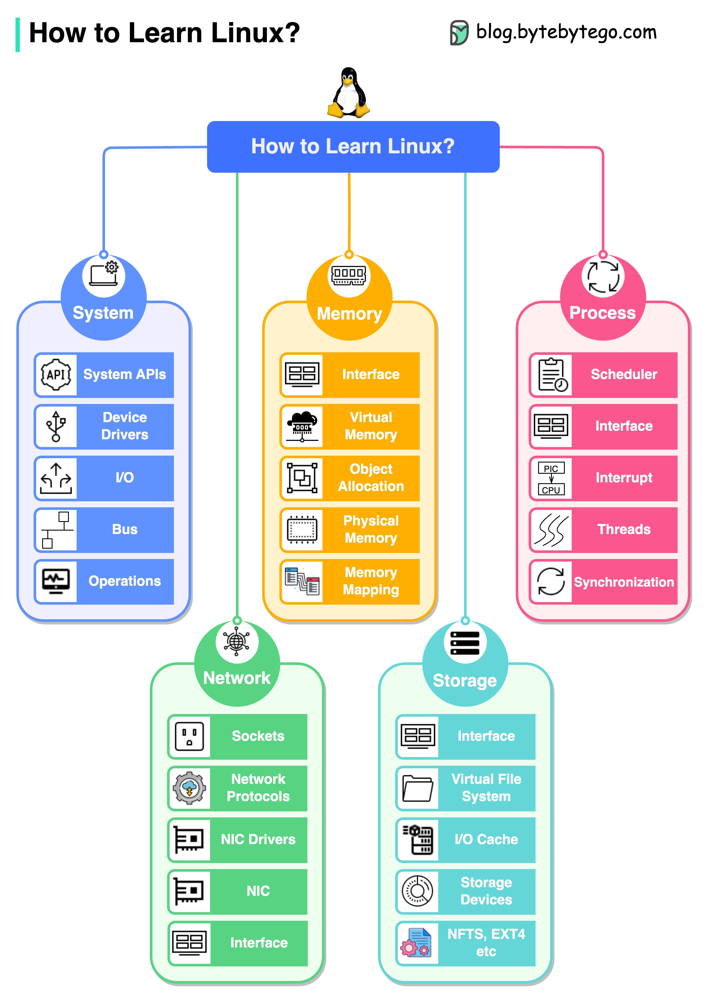

# 🐧 Linux的5大核心组件！搞懂操作系统的底层逻辑

> 学Linux不能只会敲命令，要理解底层架构

Linux是程序员的必备技能，但不能只停留在命令行层面。来看看Linux的5大核心组件 👇

1️⃣ **系统（System）**
系统API、设备驱动、I/O、总线等。这是硬件和软件之间的桥梁

2️⃣ **内存（Memory）**
物理内存、虚拟内存、内存映射、对象分配。理解内存管理才能写出高性能程序

3️⃣ **进程（Process）**
进程调度、中断、线程、同步。多任务处理的核心

4️⃣ **网络（Network）**
网络协议、Socket、网卡驱动。网络编程的基础

5️⃣ **存储（Storage）**
文件系统、I/O缓存、存储设备、文件系统实现。数据持久化的关键

💡 这5个组件相互协作，构成了完整的操作系统。建议从进程和内存开始学，这两个对日常开发帮助最大。

---

#Linux #操作系统 #程序员 #计算机基础 #后端开发 #技术干货
