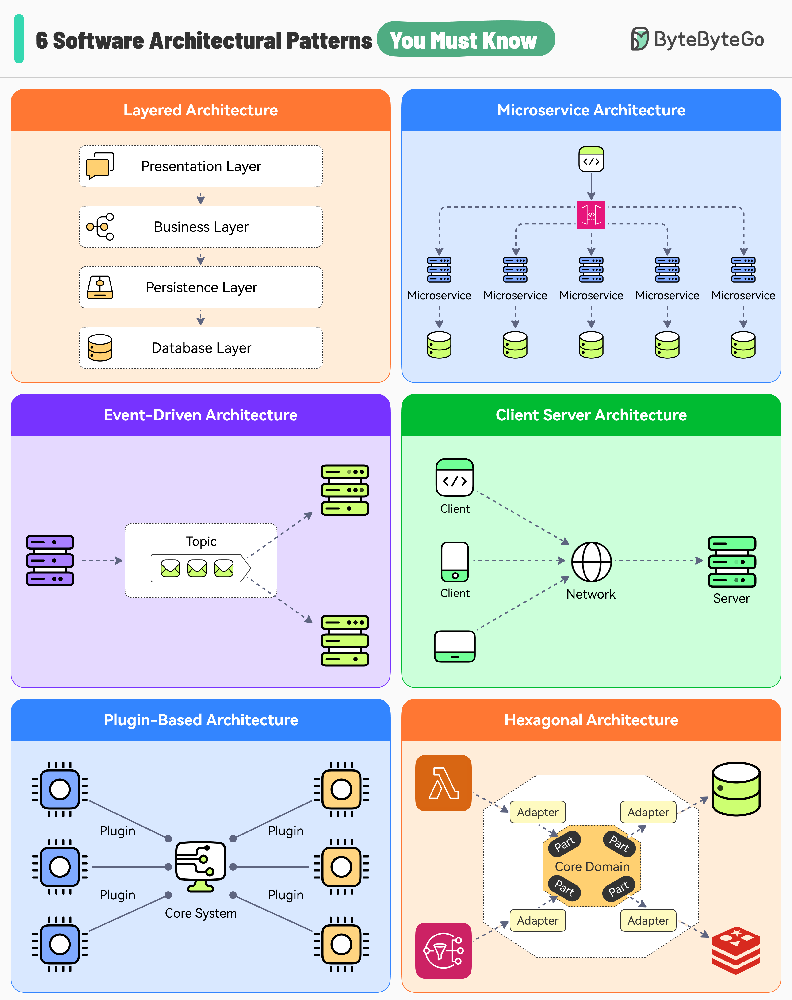

# 🏗️ 必知的6种软件架构模式！选对架构事半功倍

> 架构选错，后面全是坑。先搞懂这6种再动手

选对架构模式是项目成功的关键。这6种最常用的架构模式你必须掌握 👇

1️⃣ **分层架构（Layered）**
每层职责清晰，适合快速开发。缺点是不遵守规则容易代码混乱

2️⃣ **微服务架构（Microservices）**
大系统拆成小服务，容错性好，可独立扩展。缺点是增加系统复杂度

3️⃣ **事件驱动架构（Event-Driven）**
服务通过事件通信，松耦合。缺点是单个组件测试困难

4️⃣ **客户端-服务器架构（Client-Server）**
客户端和服务器通过网络通信，适合实时服务。缺点是服务器可能成为单点故障

5️⃣ **插件架构（Plugin-based）**
核心系统 + 插件模块，适合需要持续扩展的应用（如IDE）。缺点是核心难以修改

6️⃣ **六边形架构（Hexagonal）**
用抽象层保护核心逻辑，隔离外部集成，模块化更好。也叫端口和适配器架构。缺点是学习曲线较陡

💡 没有万能架构，关键是根据业务场景和团队能力选择最合适的。小项目别上微服务，大项目别用单体。

---

#软件架构 #系统设计 #微服务 #程序员 #技术干货 #架构师 #后端开发
