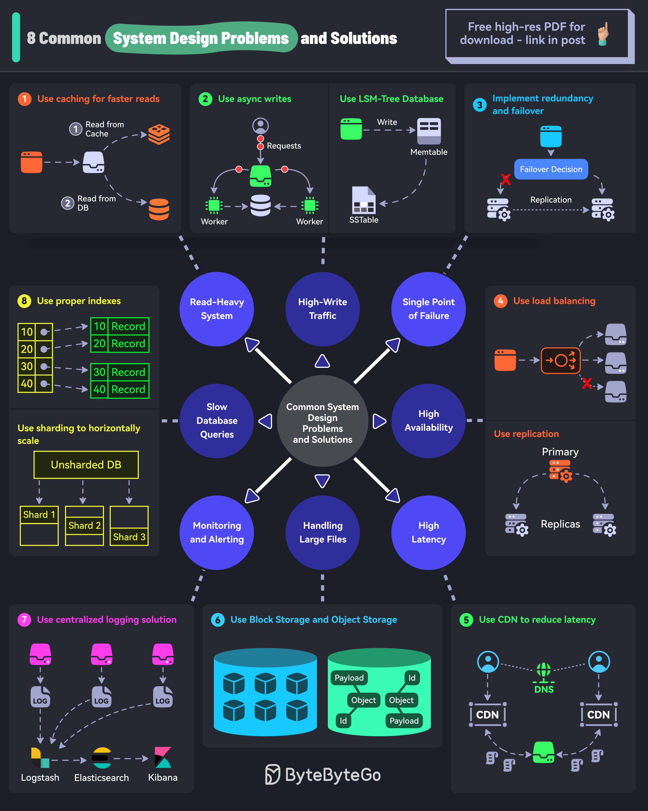

# 🔧 系统设计8大常见问题及解决方案！面试必考

> 大规模系统的经典问题，你能答出几个？

大规模生产系统中最常见的8个问题，以及对应的解决方案 👇

1️⃣ **读多写少** → 加缓存，提升读取速度

2️⃣ **写入流量大** → 异步Worker处理写入 + 使用LSM-Tree数据库

3️⃣ **单点故障** → 关键组件做冗余和故障转移

4️⃣ **高可用** → 负载均衡 + 数据库主从复制

5️⃣ **高延迟** → 上CDN，就近分发内容

6️⃣ **大文件处理** → 块存储 + 对象存储

7️⃣ **监控告警** → ELK等集中式日志系统

8️⃣ **查询慢** → 建索引 + 分片水平扩展

💡 这8个问题几乎覆盖了系统设计面试的核心考点，每个都要能展开讲清楚。

---

#系统设计 #面试 #架构师 #程序员 #后端开发 #技术干货 #分布式系统
