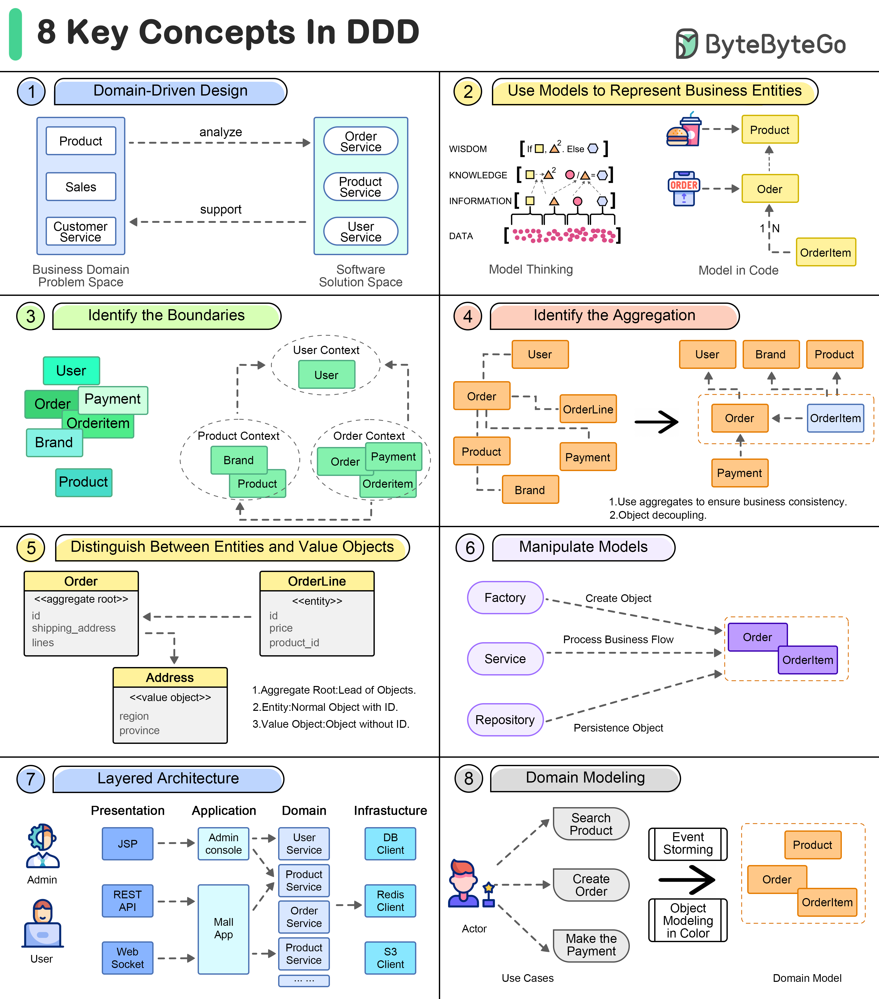

# 🧩 领域驱动设计(DDD)的8个核心概念！复杂业务建模必备

> 业务越复杂，越需要DDD来理清思路

DDD（领域驱动设计）是处理复杂业务系统的利器。8个核心概念帮你入门 👇

1️⃣ **领域驱动设计** — 通过领域建模来驱动软件设计，统一语言是关键

2️⃣ **业务实体** — 用模型表达业务概念，指导数据库、API等后续开发

3️⃣ **模型边界（限界上下文）** — 用松散边界划分领域模型，建模业务关联

4️⃣ **聚合** — 一组相关对象（实体+值对象）作为一个整体处理数据变更

5️⃣ **实体 vs 值对象** — 实体有唯一ID，值对象没有ID，是实体的附属部分

6️⃣ **操作建模** — 用"操作者"对象来操作领域模型

7️⃣ **分层架构** — 像计算机网络一样分层组织项目中的各种对象

8️⃣ **构建领域模型** — 从业务知识中提取领域模型的方法论

💡 DDD的核心不是技术，而是让开发团队和业务团队说同一种语言。先从统一语言和限界上下文开始实践。

---

#DDD #领域驱动设计 #软件架构 #程序员 #系统设计 #技术干货 #微服务
