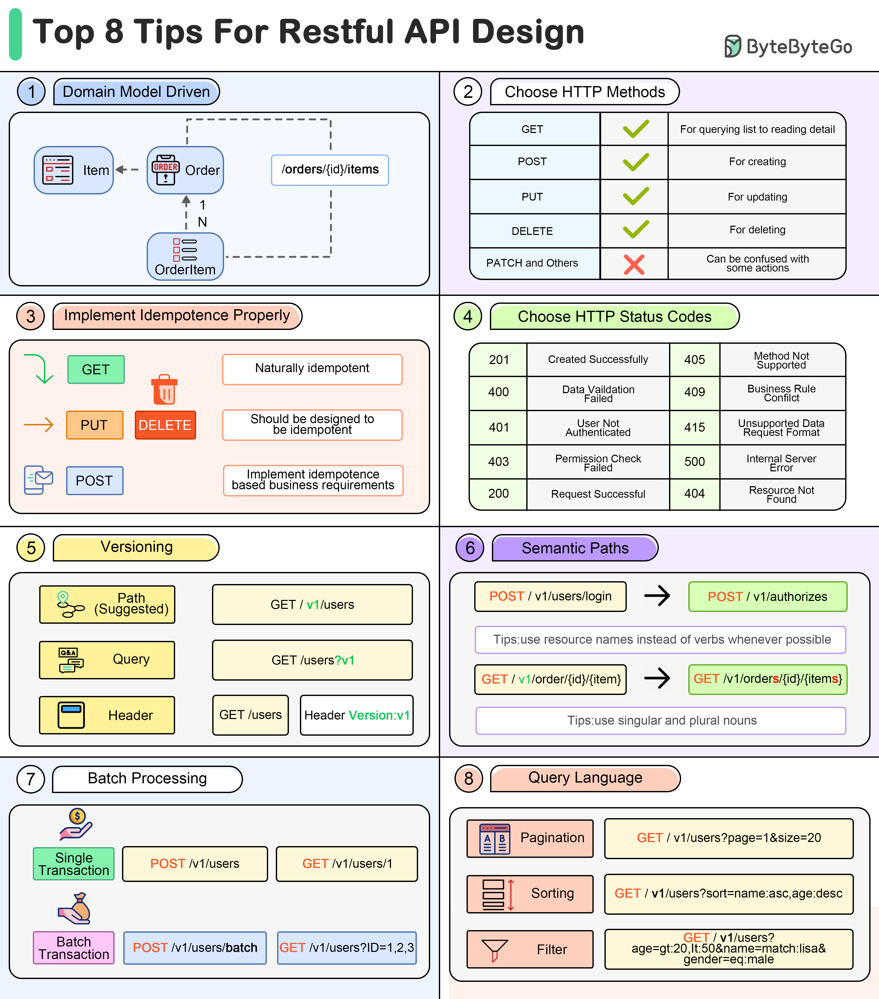

# 🔗 高效API设计的8个技巧！写出让人爱用的接口

> 好的API设计让前后端协作效率翻倍

API设计得好不好，直接影响团队协作效率。这8个技巧帮你设计出优雅的RESTful API 👇

1️⃣ **领域模型驱动** — 参考领域模型设计路径结构

2️⃣ **选对HTTP方法** — GET/POST/PUT/DELETE，PATCH要谨慎使用

3️⃣ **实现幂等性** — GET天然幂等，POST需要额外设计

4️⃣ **选对状态码** — 定义有限的状态码集合，简化开发

5️⃣ **版本控制** — 提前设计版本号，简化后续升级

6️⃣ **语义化路径** — 路径要有意义，用户看文档就能找到对应API

7️⃣ **批量处理** — 用 batch/bulk 关键字放在路径末尾

8️⃣ **查询语言** — 设计分页、排序、过滤等查询规则，让API更灵活

💡 API是系统的"门面"，设计时多花一点时间，后面能省很多沟通成本。

---

#API #RESTful #后端开发 #程序员 #系统设计 #技术干货 #接口设计
