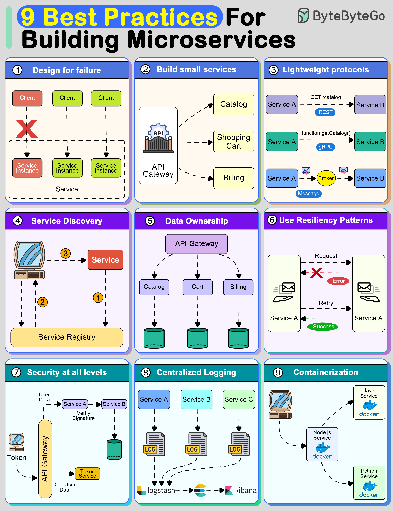

# 🏗️ 构建微服务的9条最佳实践！避坑指南

> 微服务不是拆就完了，不遵循原则会更痛苦

微服务架构很强大，但不遵循原则会变成灾难。这9条实践帮你少踩坑 👇

1️⃣ **为失败而设计** — 分布式系统一定会失败，用熔断器、舱壁隔离、优雅降级来应对

2️⃣ **服务要小** — 一个微服务只做一件事，做好它

3️⃣ **轻量级通信** — REST、gRPC或消息队列，保持通信简单

4️⃣ **服务发现** — 用Consul、Eureka或K8s Services让服务互相找到对方

5️⃣ **数据自治** — 每个服务管理自己的数据，减少耦合

6️⃣ **弹性模式** — 重试策略、缓存、限流，提升可用性

7️⃣ **全链路安全** — 攻击面大，每一层都要做安全防护

8️⃣ **集中式日志** — 多服务环境下，集中日志是排查问题的生命线

9️⃣ **容器化部署** — Docker + Kubernetes，简化部署和扩展

💡 微服务的核心是"独立部署、独立扩展"。如果做不到这两点，可能还不如用单体。

---

#微服务 #架构 #Docker #Kubernetes #程序员 #后端开发 #技术干货
