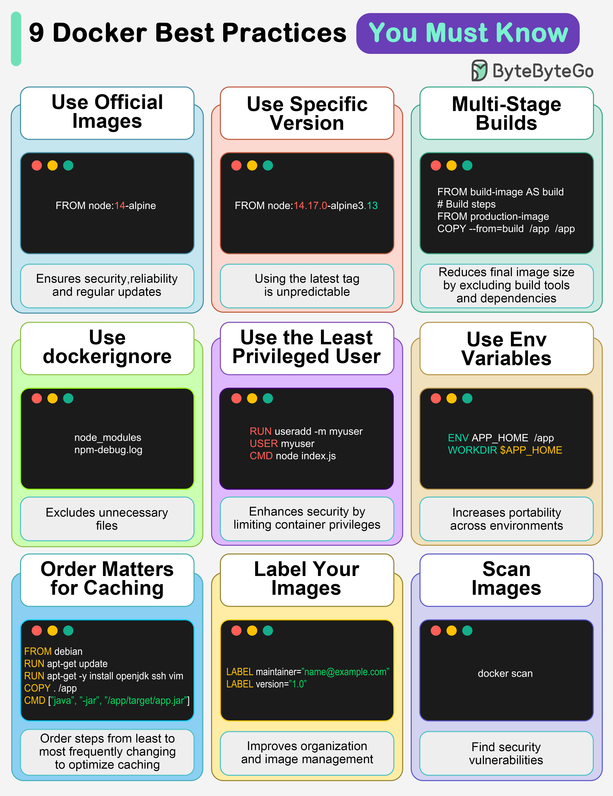

# 🐳 Docker必知的9条最佳实践！容器化不踩坑

> 用Docker不难，用好Docker才是本事

Docker用起来简单，但要用好需要遵循这9条实践 👇

1️⃣ **使用官方镜像** — 安全、可靠、定期更新

2️⃣ **指定镜像版本** — 别用latest标签，不可预测会出问题

3️⃣ **多阶段构建** — 排除构建工具，减小最终镜像体积

4️⃣ **使用.dockerignore** — 排除不必要文件，加速构建

5️⃣ **最小权限用户** — 限制容器权限，增强安全性

6️⃣ **使用环境变量** — 提高灵活性和跨环境可移植性

7️⃣ **注意指令顺序** — 不常变的放前面，利用缓存加速构建

8️⃣ **给镜像打标签** — 方便管理和组织

9️⃣ **扫描镜像漏洞** — 在问题变大之前发现安全隐患

💡 最容易被忽略的是第7条：Dockerfile指令顺序直接影响构建速度，把COPY package.json放在COPY . 前面就是这个道理。

---

#Docker #容器化 #DevOps #程序员 #后端开发 #技术干货 #运维
