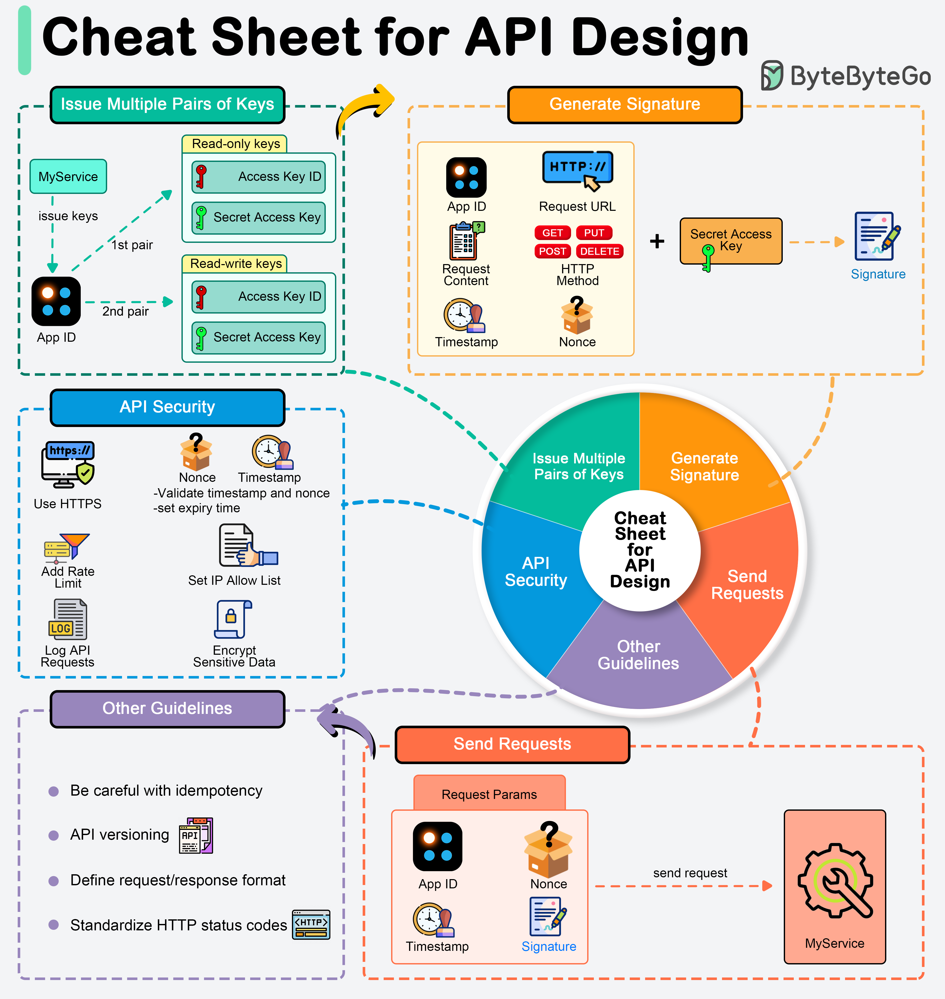

# 🔐 API设计安全速查表！从密钥到签名全搞定

> API暴露了业务逻辑和数据，安全设计至关重要

API对外暴露业务逻辑和数据，安全高效的设计是基础 👇

🔑 **API密钥生成**
- 每个客户端生成唯一的App ID
- 不同权限生成不同的公钥/私钥对（只读、读写分开）

✍️ **签名生成**
签名用于验证请求的真实性和完整性：
1. 收集参数
2. 创建待签名字符串
3. 用HMAC-SHA256和密钥进行哈希
4. 发送请求

📋 **请求参数应包含**
- 认证凭证
- 时间戳（防重放攻击）
- 业务数据（用户ID、交易详情等）
- Nonce随机字符串（确保请求唯一性）

🛡️ **安全准则**
遵循安全指南，防范常见漏洞和威胁

💡 API安全的核心：认证（你是谁）+ 授权（你能做什么）+ 完整性（数据没被篡改）。

---

#API #安全 #后端开发 #程序员 #系统设计 #技术干货 #接口
