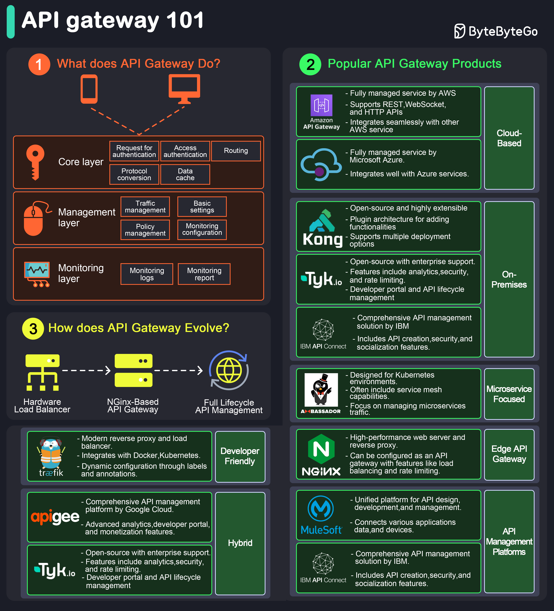

# 🚪 API网关入门！微服务架构的"大门管家"

> 所有请求的统一入口，安全、路由、限流一把抓

API网关是客户端和后端服务之间的"中间人"，管理和优化API流量 👇

🔑 **6大核心功能**

1️⃣ **请求路由** — 把请求导向正确的后端服务

2️⃣ **负载均衡** — 分散请求到多台服务器，避免单点过载

3️⃣ **安全防护** — 认证、授权、数据加密

4️⃣ **限流节流** — 控制客户端在一定时间内的请求数量

5️⃣ **API组合** — 把多个后端请求合并成一个前端请求，优化性能

6️⃣ **缓存** — 临时存储响应，减少重复处理

💡 API网关就像酒店的前台：接待客人（接收请求）、分配房间（路由）、检查身份（认证）、控制人流（限流）。

---

#API网关 #微服务 #后端开发 #程序员 #系统设计 #技术干货
