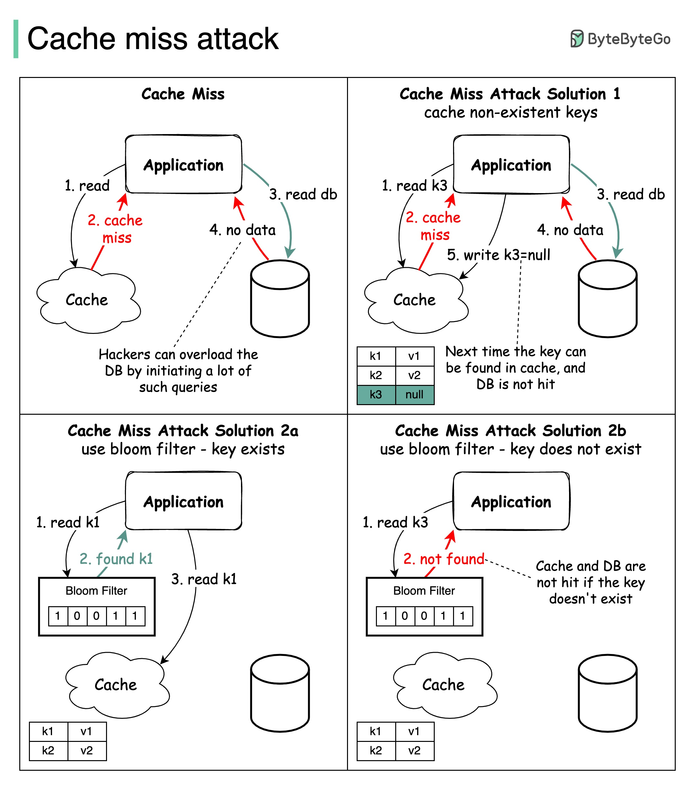

# 🛡️ 缓存穿透攻击！你的缓存可能是个摆设

> 查不存在的数据，每次都打到数据库，缓存形同虚设

缓存虽好，但有个致命问题：缓存穿透攻击 👇

⚠️ **什么是缓存穿透？**
请求的数据在数据库中不存在，缓存里也没有，每次请求都直接打到数据库。如果恶意用户大量发送这类请求，数据库很容易被打垮。

✅ **两种解决方案**

1️⃣ **缓存空值**
- 查询结果为空时，也把空值缓存起来
- 设置较短的TTL（过期时间）
- 简单有效，但会占用一些缓存空间

2️⃣ **布隆过滤器（Bloom Filter）**
- 快速判断一个元素是否存在于集合中
- 如果布隆过滤器说"不存在"，直接返回，不查缓存也不查数据库
- 如果说"可能存在"，再走正常的缓存→数据库流程

💡 生产环境建议两种方案结合使用，布隆过滤器做第一道防线，空值缓存做兜底。

---

#缓存 #Redis #安全 #后端开发 #程序员 #系统设计 #技术干货
