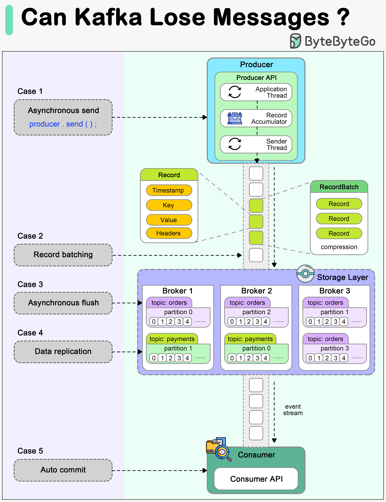

# ⚠️ Kafka会丢消息吗？三个环节都可能出问题

> 很多人以为Kafka不会丢消息，其实不然

很多开发者认为Kafka天生不丢消息，但实际上在生产者、Broker和消费者三个环节都可能丢 👇

📤 **生产者（Producer）**
- send()不是直接发到Broker，中间有应用线程→累加器→发送线程
- 需要正确配置acks和retries才能保证消息送达

🖥️ **Broker**
- 消息通常异步刷盘（为了高吞吐），实例宕机前没刷盘就丢了
- 副本配置不当，数据同步不确定性也会导致丢失

📥 **消费者（Consumer）**
- 自动提交offset可能在消息实际处理前就确认了
- 消费者处理中途宕机，部分消息永远不会被处理

✅ **最佳实践**
- Producer：acks=all + 合理重试
- Broker：多副本 + min.insync.replicas
- Consumer：同步+异步提交结合，异常时同步提交确保offset正确

💡 Kafka不丢消息不是默认的，需要正确配置才能实现。

---

#Kafka #消息队列 #后端开发 #程序员 #分布式系统 #技术干货
