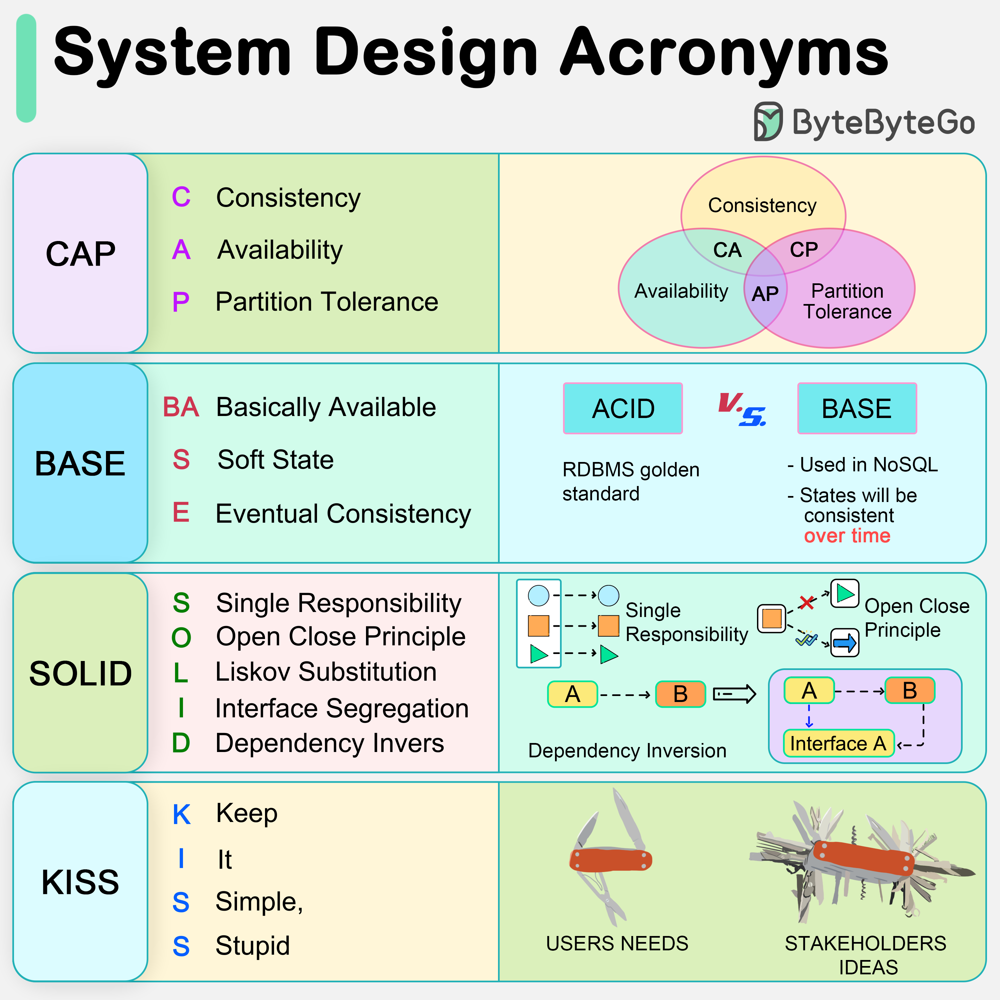

# 🔤 CAP、BASE、SOLID、KISS！这些缩写到底啥意思？

> 系统设计中最常见的缩写词，一次搞懂

面试和工作中经常遇到这些缩写，来一次性搞清楚 👇

📌 **CAP定理**
分布式系统只能同时满足三个中的两个：
- C（一致性）— 所有节点看到相同数据
- A（可用性）— 每个请求都能得到响应
- P（分区容错）— 网络分区时系统继续运行

📌 **BASE**
NoSQL数据库的设计原则（对比ACID）：
- 基本可用（Basically Available）
- 软状态（Soft State）
- 最终一致（Eventually Consistent）

📌 **SOLID**
面向对象编程五大原则：
- S — 单一职责
- O — 开闭原则
- L — 里氏替换
- I — 接口隔离
- D — 依赖倒置

📌 **KISS**
"Keep It Simple, Stupid!" — 保持简单，大多数系统越简单越好

💡 这些不只是面试八股文，理解背后的思想对日常设计决策很有帮助。

---

#系统设计 #SOLID #CAP #程序员 #面试 #技术干货 #编程
