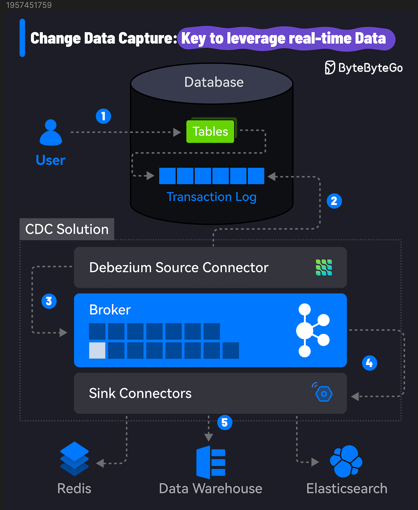

# 🔄 CDC变更数据捕获！实时数据同步的关键技术

> 数据库、数据湖、数据仓库不同步？CDC帮你搞定

全球90%的数据是最近两年产生的，最大的挑战是如何实时利用这些数据。CDC可以帮你 👇

📌 **什么是CDC？**
识别并捕获数据库中的数据变更，实现跨系统的数据复制和同步

📌 **工作流程**
1. 数据修改 — 源数据库发生增删改操作
2. 变更捕获 — CDC工具监控数据库事务日志
3. 变更处理 — 转换成下游系统适用的格式
4. 变更传播 — 发布到消息队列，传播到目标系统
5. 实时集成 — 目标系统（数据仓库、Redis等）实时更新

用户只需关心第1步，其余都是透明的。

📌 **流行方案**
Debezium + Kafka Connect，支持MySQL、PostgreSQL、Oracle等主流数据库

💡 CDC是构建实时数据管道的核心技术，特别适合数据仓库同步、缓存更新、搜索索引更新等场景。

---

#CDC #数据同步 #Kafka #数据库 #程序员 #数据工程 #技术干货
