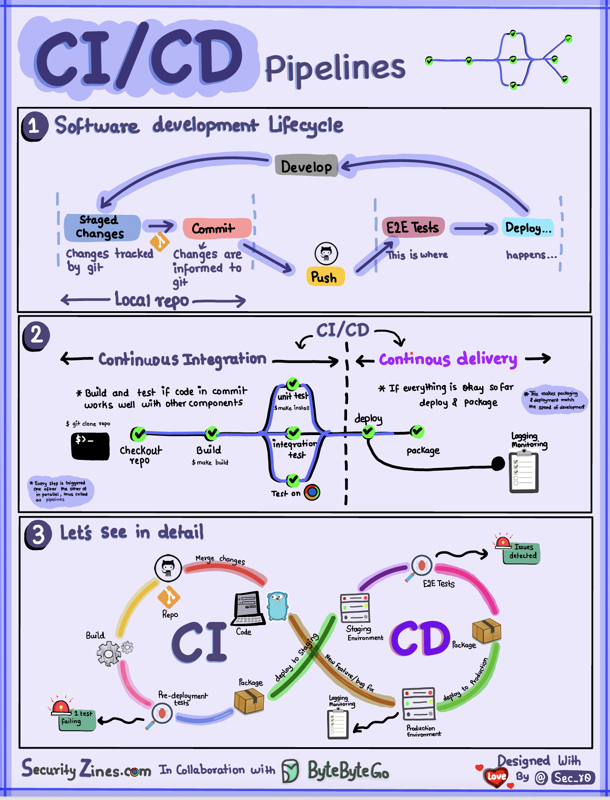

# 🔄 CI/CD流水线通俗解释！自动化交付的核心

> 代码提交后自动构建、测试、部署，这就是CI/CD

CI/CD自动化了软件开发的构建、测试和部署阶段 👇

📌 **CI（持续集成）**
- 自动化构建、测试和合并
- 每次提交代码都运行测试，尽早发现集成问题
- 鼓励频繁提交，快速反馈

📌 **CD（持续交付/部署）**
- 自动化发布流程（基础设施变更、部署）
- 确保软件随时可以可靠发布
- 可能还自动化生产部署前的手动测试和审批

📌 **典型流水线**
1. 开发者提交代码
2. CI服务器检测变更，触发构建
3. 编译代码，运行单元/集成测试
4. 测试结果反馈给开发者
5. 成功后部署到预发布环境
6. 预发布环境进一步测试
7. CD系统将审批通过的变更部署到生产

💡 CI/CD的核心价值：快速反馈 + 降低发布风险。没有CI/CD的团队，发布日就是噩梦日。

---

#CICD #DevOps #自动化 #程序员 #后端开发 #技术干货
