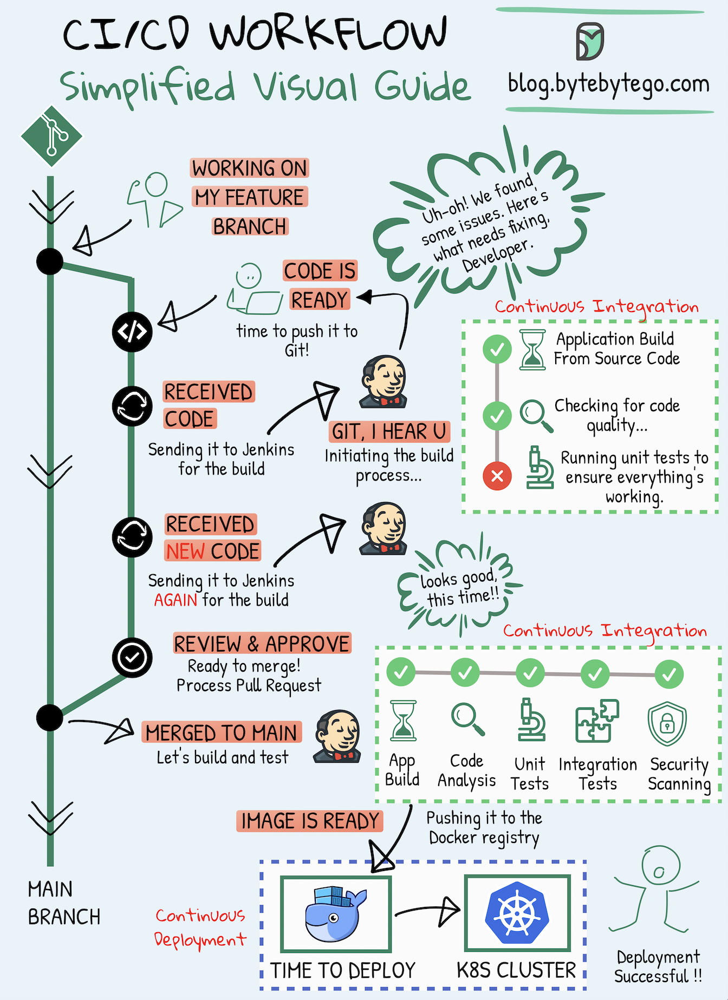

# 🎯 CI/CD可视化指南！一图看懂持续集成和部署

> 不管你是开发、测试还是运维，CI/CD都是必修课

CI/CD已经成为现代软件开发的标配 👇

📌 **持续集成（CI）**
代码变更频繁合并到共享仓库，自动检查新代码与现有代码的兼容性

📌 **持续部署（CD）**
自动将代码变更部署到生产环境，确保发布过程平滑可靠

💡 CI/CD的目标：让软件交付更快、更可靠、更频繁。从手动发布到自动化流水线，是团队效率的质变。

---

#CICD #DevOps #自动化 #程序员 #技术干货 #软件开发
