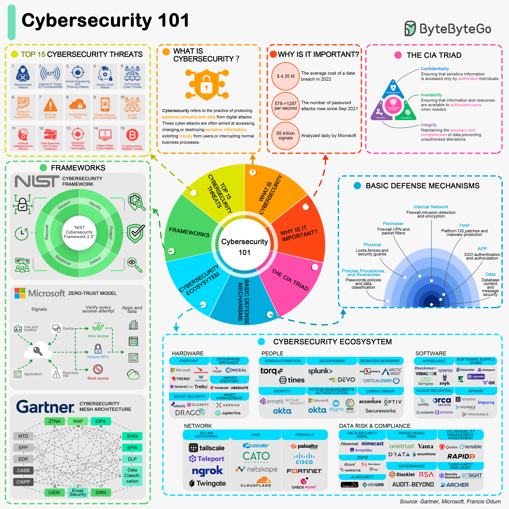

# 🛡️ 网络安全入门！一张图搞懂基础概念

> 程序员必备的安全意识，从这里开始

网络安全的核心概念，一图速览 👇

📌 **CIA三要素**
- 机密性（Confidentiality）— 数据不被未授权访问
- 完整性（Integrity）— 数据不被篡改
- 可用性（Availability）— 系统随时可用

📌 **常见威胁**
- 恶意软件、钓鱼攻击、DDoS、SQL注入等

📌 **基本防御机制**
- 防火墙 — 监控和控制网络流量
- 杀毒软件 — 检测和清除恶意软件
- 加密 — 将信息转换为密文防止未授权访问

📌 **安全框架**
- NIST、ISO 27001等标准化安全管理

💡 安全不是安全团队的事，每个开发者都应该有安全意识。从代码层面防御是第一道防线。

---

#网络安全 #安全 #程序员 #技术干货 #信息安全
