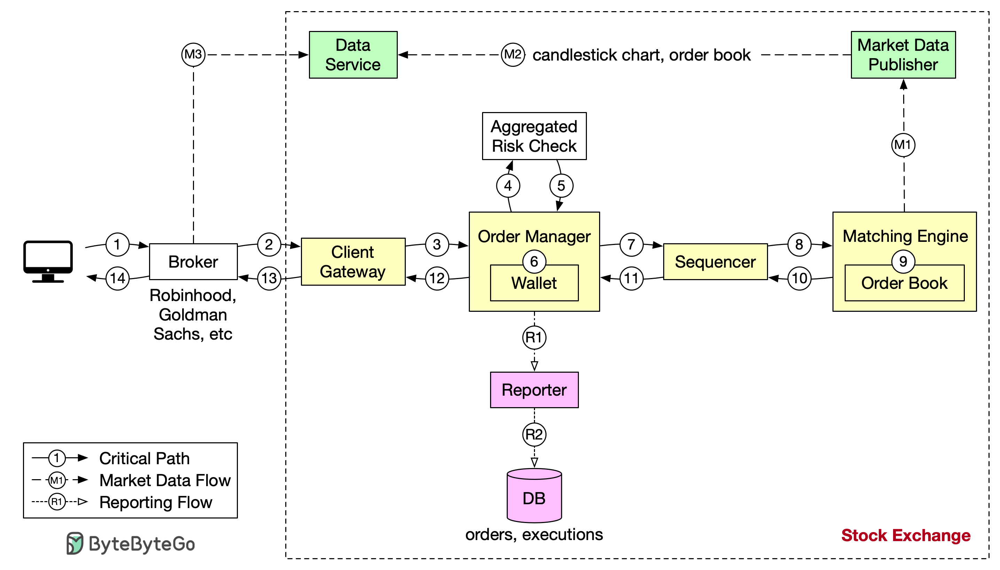

# 📈 设计证券交易所！一笔订单的完整生命周期

> 从下单到成交，每一步都有严格的延迟要求

一笔交易订单在证券交易所中的完整旅程 👇

📌 **交易流程（关键路径，延迟要求极高）**
1. 客户通过券商App下单
2. 券商将订单发送到交易所
3. 订单进入客户端网关（输入验证、限流、认证、标准化）
4-5. 订单管理器执行风控检查
6. 验证钱包余额是否充足
7-9. 订单发送到撮合引擎，找到匹配后生成买卖双方的执行记录
10-14. 执行结果返回给客户

📌 **非关键路径**
- 行情数据流
- 报告流
- 延迟要求相对宽松

💡 证券交易所是对延迟要求最极致的系统之一，撮合引擎通常要求微秒级响应。

---

#证券交易 #系统设计 #低延迟 #金融科技 #程序员 #技术干货
