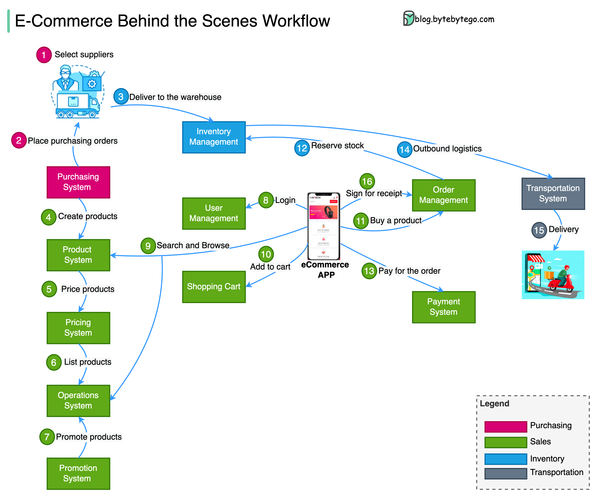

# 🛒 电商系统完整工作流！从采购到配送全链路

> 网购一件商品，背后经历了这么多环节

网购时背后发生了什么？4大业务领域全链路解析 👇

📦 **采购（Procurement）**
1. 采购部门选择供应商、管理合同
2. 向供应商下单、管理退货、结算发票

🏭 **库存（Inventory）**
3. 供应商的商品送到仓库，由库存管理系统统一管理

🖥️ **电商平台（EComm Platform）**
4-7. 创建商品信息、定价、上架、设置促销活动和优惠券
8-11. 用户注册/登录 → 浏览商品 → 加入购物车 → 下单
12-13. 订单系统预留库存 → 用户支付

🚚 **物流（Transportation）**
14-15. 库存系统发出出库单 → 物流系统管理配送
16. 签收

💡 思考题：如果用户买了很多商品，大订单可能按仓库位置、商品类型拆成多个小订单。你会把"拆单系统"放在哪个环节？

---

#电商 #系统设计 #供应链 #程序员 #技术干货 #后端开发
