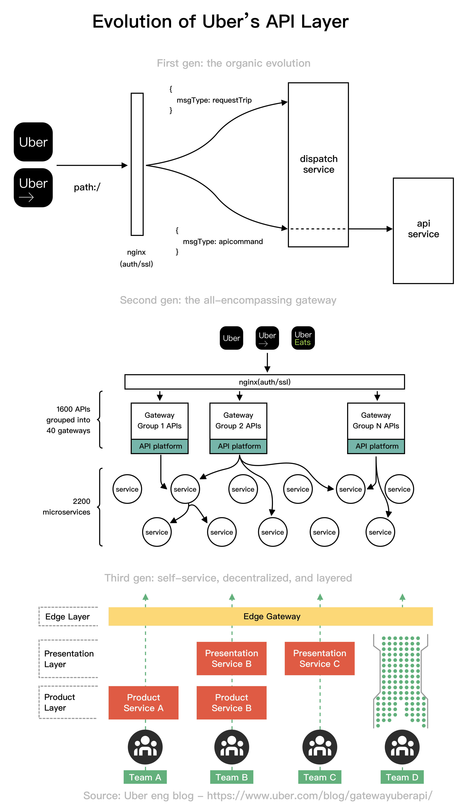

# 🚗 Uber API层进化三代！从2个服务到2200+微服务

> Uber的API网关是怎么跟着业务一起长大的？

Uber的API网关经历了3个阶段 👇

1️⃣ **第一代：自然生长（2014）**
只有两个核心服务：调度服务（连接乘客和司机）和API服务（存储用户和行程数据）

2️⃣ **第二代：全能网关（2019）**
Uber很早就采用微服务架构，到2019年已有2200+微服务

3️⃣ **第三代：自助、去中心化、分层**
2018年后，Uber新增了货运、自动驾驶、外卖等业务线，需要全新的API层架构

💡 Uber的进化说明：API层要跟着业务复杂度一起演进，没有一劳永逸的方案。

---

#Uber #API #微服务 #系统架构 #程序员 #大厂案例 #技术干货
