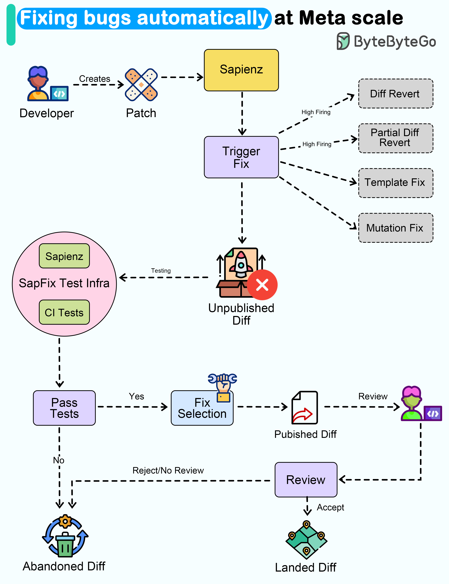

# 🤖 Meta如何自动修Bug！SapFix系统揭秘

> 从发现bug到生成修复补丁，中位时间只要69分钟

Meta的SapFix工具能自动检测和修复bug，来看看它有多强 👇

📌 **成绩单**
- 覆盖6个核心App（Facebook、Messenger、Instagram等）
- 每个App数千万行代码
- 90天试点期生成165个补丁，修复57个崩溃
- 从发现bug到生成修复的中位时间：69分钟

📌 **工作流程**
1. 开发者提交代码变更
2. SapFix从Sapienz（自动测试系统）选择测试用例执行
3. 检测到崩溃后，尝试生成修复（模板修复、变异修复、完全回滚、部分回滚）
4. 在修补后的构建上运行测试，验证哪个有效
5. 选择候选补丁发送给人工审核
6. 开发者可以接受或拒绝修复

💡 SapFix不是要替代开发者，而是加速修复流程。最终决定权还是在人手里。

---

#Meta #自动化 #调试 #程序员 #AI #技术干货 #大厂案例
