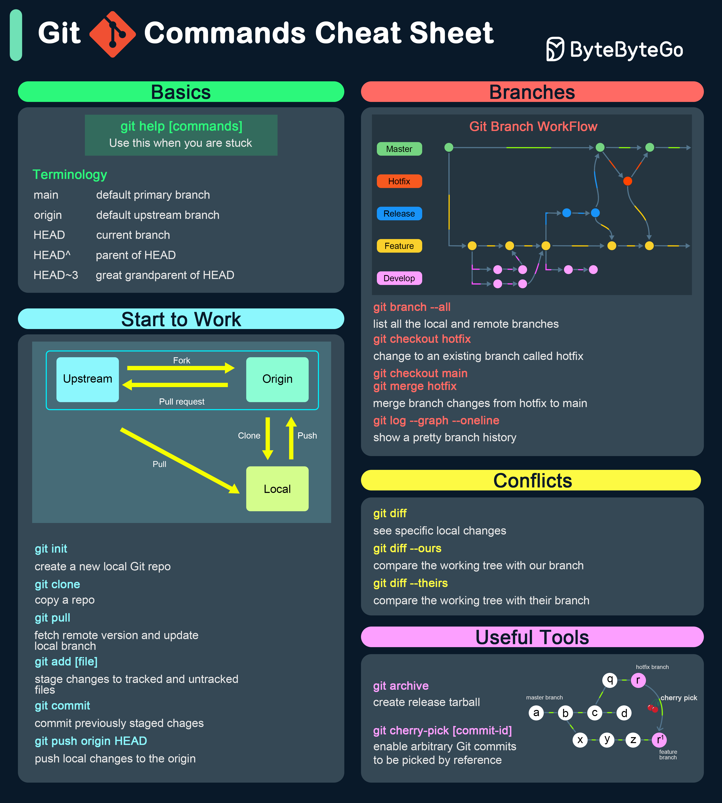

# 📋 Git命令速查表！开发者必备

> 最常用的Git命令，收藏这一张就够了

Git最常用的命令，按场景分类 👇

🚀 **入门**
- `git init` — 初始化新仓库
- `git clone [url]` — 克隆远程仓库

✏️ **修改**
- `git add [file]` — 添加到暂存区
- `git commit -m "msg"` — 提交变更
- `git status` — 查看工作区状态
- `git diff` — 查看差异

🌿 **分支与合并**
- `git branch` — 列出分支
- `git branch [name]` — 创建分支
- `git checkout [name]` — 切换分支
- `git merge [name]` — 合并分支
- `git branch -d [name]` — 删除分支

☁️ **远程仓库**
- `git remote add origin [url]` — 添加远程仓库
- `git push origin [branch]` — 推送
- `git pull origin [branch]` — 拉取
- `git fetch` — 获取远程变更（不合并）

⏪ **撤销**
- `git reset [file]` — 取消暂存
- `git checkout -- [file]` — 丢弃修改
- `git revert [commit]` — 撤销某次提交

💡 最常用的5个：add、commit、push、pull、checkout。先记住这几个就能开始工作了。

---

#Git #版本控制 #程序员 #开发工具 #技术干货 #编程
