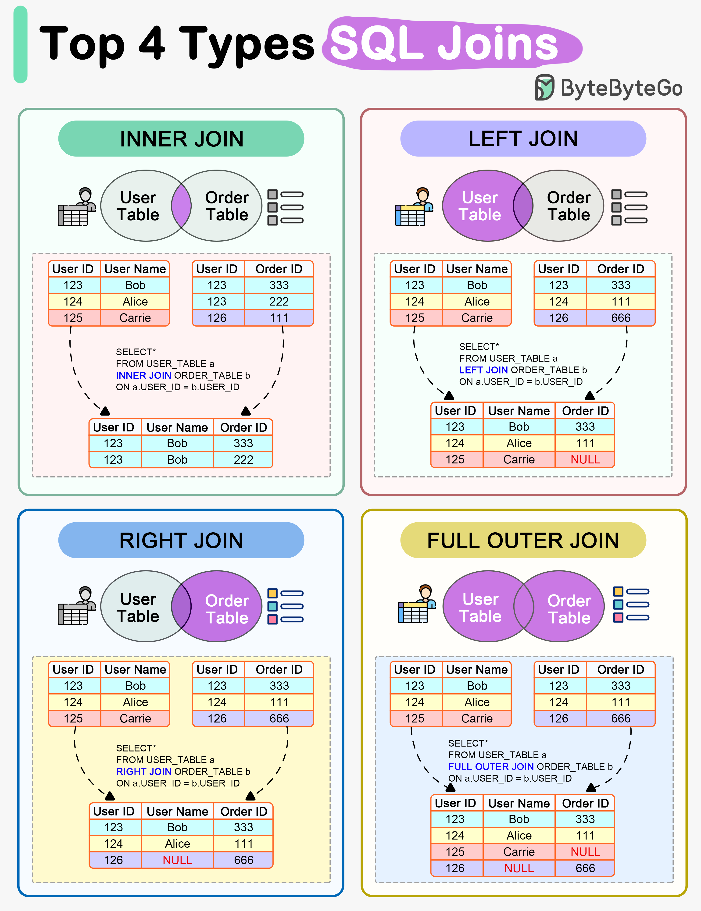

# 🔗 SQL JOIN的4种类型！一图看懂

> 面试必考，工作必用

4种SQL JOIN的工作方式 👇

📌 **INNER JOIN** — 返回两个表中匹配的行

📌 **LEFT JOIN** — 返回左表所有记录 + 右表匹配的记录

📌 **RIGHT JOIN** — 返回右表所有记录 + 左表匹配的记录

📌 **FULL OUTER JOIN** — 返回两个表中任一匹配的所有记录

💡 最常用的是INNER JOIN和LEFT JOIN。记住：LEFT JOIN保留左表全部数据，没匹配到的右表字段为NULL。

---

#SQL #数据库 #面试 #程序员 #编程 #技术干货
